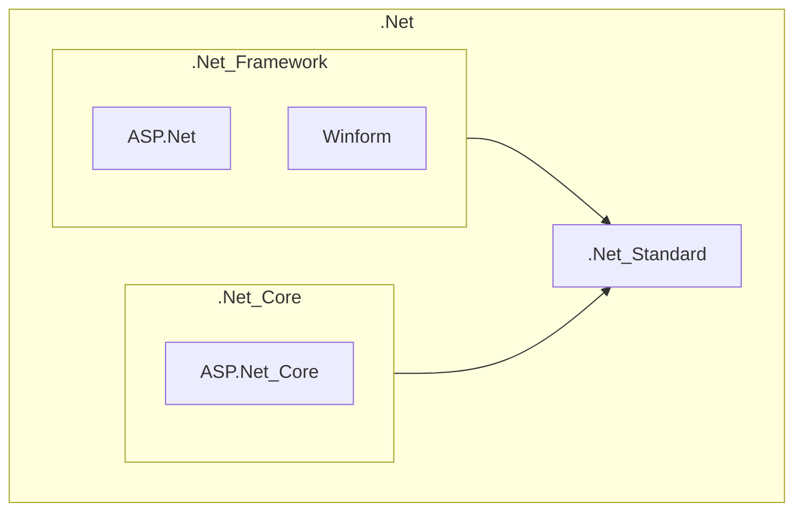
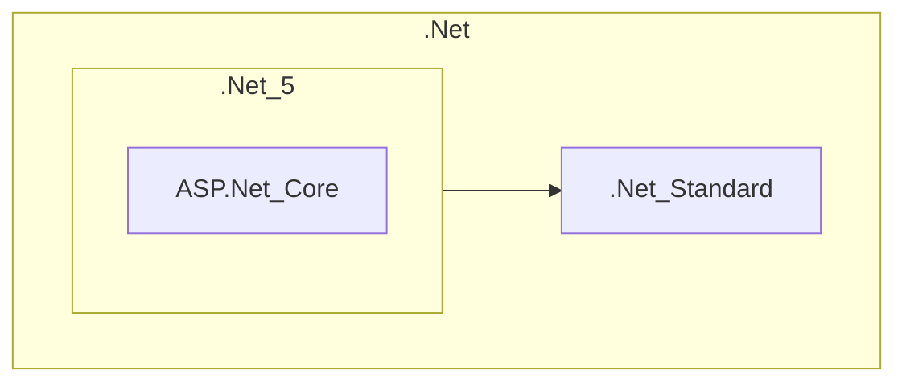

.Net 中的架构和技术名称总是让人“眼花缭乱”，借这个机会进行总结和提炼，理清常用的`.Net`技术框架的用途和各个技术框架之间的联系

# .Net
- 分为两部分：.Net Framework 和 .Net平台
- `.Net Framework` 用于保证 .Net平台的运行和开发（`.Net平台`类比于中国互联网平台， `.Net Framework`相当于中国移动、联通，用于保障互联网的正常运行）
- `.Net`的开发应用： Winform（桌面应用程序）、ASP.NET（Internet应用程序）、WP8（手机开发）、Unity3D（游戏开发或虚拟现实）
- 交互方式：B/S & C/S

# .Net Standard
- 为 .Net Framework 和 .Net Core 一共统一标准（即`.Net Framework` 和 `.Net Core`是`.Net Standard`标准下的不同实现）

# .Net Framework
.Net程序开发和运行的环境，目前最新的版本为 v4.8，不会再继续更新；其“继任者” `.Net 5`(`.Net Core` 的完全体)会取代该框架
包含如下内容：
- 编程语言(C# ,Visual Basic ,Visual C++)
- .NET开发工具(Visual Studio .NET)
- .NET框架(.NET Framework)
使用场景：
- 需要ASP.Net相关支持的项目
- WPF和WinForm

# Winform
- 基于`.Net Framework`的一个windows窗体程序的客户端应用技术
- 不兼容`.Net Core`

# .Net Core
.Net Framework 针对无法跨平台的缺点，推出的跨平台.Net程序开发和运行的环境，目前.Net Core更新的重要一环就是将.Net Framework上的技术和功能移植到.Net Core上；当这一进程结束时，`.Net Core`就会正式更名为.Net 5 以取代.Net Framework，.Net Framework 4.8 是该框架的最后一个版本  
移除了 .Net Framework 中过时的技术（如 ASP.Net）

# ASP.Net & ASP.Net Core
- ASP.Net是一个网站开发的技术，通常是用 VBScript 编写的。是`.NET Framework`中的一个应用模型，已经过时，不再介绍
- ASP.Net Core 是 ASP.Net的 “继任者”，可以在 `.Net Framework`上运行，也可以在 `.Net Core` 上运行

# 以上几者的关系
* 目前（过渡时期）：`.Net Framework` 与 `.Net Core` 同时存在

* .Net 5 时代
- `.Net Framework`被取代，其中的过时技术被淘汰（如`ASP.Net`）
- `.Net Core` 更名为`.Net 5`

---
# 参考
* [.net、.net core、.net framework、asp.net](https://blog.csdn.net/fronde2233/article/details/120043869)
* [.Net 初步学习笔记之一——.Net 平台与.Net FrameWork框架的关系](https://blog.csdn.net/u012092924/article/details/78678953)