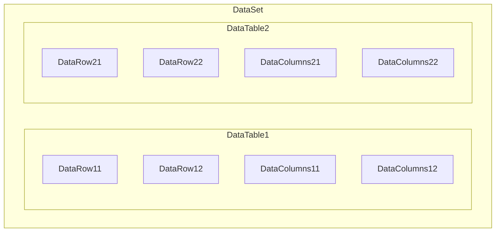

# DataColumns，DataRow，DataTable以及DataSet关系

* `DataColumns` 相当于 数据表的字段，代表表结构
* `DataRow` 相当于 数据表的数据
* `DataTable` 相当于 数据表
* `DataSet` 是`DataTable`的集合


# DataColums
## 添加 DataColumns
```cs
var tb = new DataTable("Datas");

// 增添列，参数为(列名，类型名)
tb.Columns.Add("Product", Type.GetType("System.String"));
tb.Columns.Add("Price", Type.GetType("System.Decimal"));
// 也可以只输入列名
tb.Columns.Add("Description");

// 给 tb 增加 ID 列
DataColumn dcID = null;
dcID = tblDatas.Columns.Add("ID", Type.GetType("System.Int32"));
dcID.AutoIncrement = true;  //自动增加
dcID.AutoIncrementSeed = 1;  //起始为1
dcID.AutoIncrementStep = 1;  //步长为1
dcID.AllowDBNull = false;  //不允许为空

// 给列添加表达式，用于计算列中的值或创建聚合列
var dcTax = new DataColumn();
dcTax.DataType = System.Type.GetType("System.Decimal");
dcTax.ColumnName = "Tax";
dcTax.Expression = "Price * 0.0862";  //设置该列的表达式
tb.Columns.Add(dcTax);
// 第二种添加表达式的方式(推荐)
tb.Columns.Add("Total", Type.GetType("System.Decimal"), "Price + Tax");
```

## 遍历DataColumns
```cs
//遍历Datatable中所有列并打印每一行的表头
var colList = new List<string>();
foreach (var col in dt0.Columns)
{
    colList.Add((col as DataColumn).ColumnName);
}
```

# DataRow
## 添加 DataRow
```cs
// 生成一个DataTable
var tb = new DataTable("Datas");
tb.Columns.Add("Product");
tb.Columns.Add("Price");
tb.Columns.Add("Description");

// 增加一列
tb.Rows.Add(new object[] {"My Prod", 1.00, "So good~" });

// 但如果table的字段太复杂，建议用下面的方法
var row = tb.NewRow();  // newRow 后 DataRow的 列结构与 tb一样
row["Product"] = "My second book";
row["Price"] = 2.00;
row["Description"] = "Better than first one";
tb.Rows.Add(row);
```

## 将DataRow赋值给其他table
* DataRow无法直接赋值给其他DataTable，需要将Row通过`ItemArray()`函数转换成数组进行赋值，需保证两张表的Columns完全一致
* 使用`ItemArray()`该函数时，务必保证两张表Column的顺序，名称，类型完全一致才可以使用
    ```cs
    // 新建一张表 & 插入数据
    var tb = new DataTable("Datas");
    tb.Columns.Add("Product");
    tb.Rows.Add(new object[] {"A"});
    tb.Rows.Add(new object[] {"B"});

    // 将 tb 的数据赋值给 newTb
    var newTb = tb.Clone();  // 克隆tb的表结构，返回一张无数据的新表
    foreach (DataRow row in tb.Rows){
        newTb.Rows.Add(row.ItemArray);
    }
    ```

# DataTable
## select 筛选数据
* 与[Linq](./CSharp_Linq.md)中的where相似，用于筛选出满足条件的`DataRow[]`
    ```csharp
    var dt = new DataTable();
    // 常规 (查寻 ID = 3 的全部DataRow)
    var res0 = dt.Select("ID = '3'");

    // 查寻 name = zhangSan 的全部 DataRow
    var res1 = dt.Select(" name = 'zhangSan'");

    // 查寻 name = zhangsan 且 ID > 3 的 DataRow (支持 and)
    var res11 = dt.Select(" name = 'zhangSan' AND ID > '3'");
    
    // 查询条件为变量(查寻 ID = value 的全部 DaatRow)
    int value = 4;
    var res2 = dt.Select($"ID = {value}");

    // 模糊匹配 (name 包含 zhang 的全部DataRow)
    var res3 = dt.Select($" name like '{Value}% ' "):
    ```

## Linq 筛选数据
* 将`DataTable`强转成`Enumerable`后，可使用[Linq](./CSharp_Linq.md)的所有方法
    ```csharp
    // 获取DataTable ID 列的所有值
    var infoTable = new DataTable();
    var idList = (infoTable.AsEnumerable()).Select(i => i["ID"]).ToList();
    ```

# DataSet
* 由多个DataTable组成
    ```csharp
    // 创建一个DataSet 并将两张表放入其中
    var dtSet = new DataSet();
    var newTable1 = new DataTable("newTable1");
    var newTable2 = new DataTable();
    dtSet.Tables.AddRange(new DataTable[]() { newTable1, newTable2 });

    // 通过table在set中的 index 获取表
    var tableFromIndex = dtSet.Tables[0];  // 获取 newTable1

    // 通过Table Name 获取表
    var tableFromName = dtSet.Table["newTable1"];
    ```

# DataView
* 是DataTable的视图
    ```cs
    //DataTable 转   DataView
    DataView dv = dt.DefaultView; 

    //DataView 根据某个字段的值进行筛选
    dv.RowFilter = string.Format("字段='9527'");
            
    //DataView 排序
    dv.Sort = "字段 asc";
            
    //dt只想要dv中的某几列
    DataTable dataTablene = dv.ToTable(false, new string[] { "字段1", "字段2" });
    ```