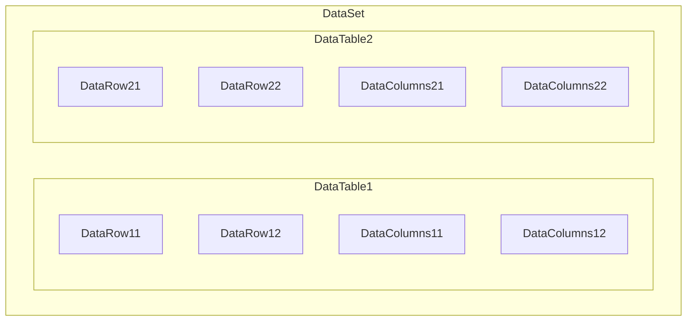

# DataColumns，DataRow，DataTable以及DataSet关系

* `DataColumns` 相当于 数据表的字段，代表表结构
* `DataRow` 相当于 数据表的数据
* `DataTable` 相当于 数据表
* `DataSet` 是`DataTable`的集合


# DataColums
## 添加 DataColumns
```cs
var tb = new DataTable("Datas");

// 增添列，参数为(列名，类型名)
tb.Columns.Add("Product", Type.GetType("System.String"));
tb.Columns.Add("Price", Type.GetType("System.Decimal"));
// 也可以只输入列名
tb.Columns.Add("Description");

// 给 tb 增加 ID 列
DataColumn dcID = null;
dcID = tblDatas.Columns.Add("ID", Type.GetType("System.Int32"));
dcID.AutoIncrement = true;  //自动增加
dcID.AutoIncrementSeed = 1;  //起始为1
dcID.AutoIncrementStep = 1;  //步长为1
dcID.AllowDBNull = false;  //不允许为空

// 给列添加表达式，用于计算列中的值或创建聚合列
var dcTax = new DataColumn();
dcTax.DataType = System.Type.GetType("System.Decimal");
dcTax.ColumnName = "Tax";
dcTax.Expression = "Price * 0.0862";  //设置该列的表达式
tb.Columns.Add(dcTax);
// 第二种添加表达式的方式(推荐)
tb.Columns.Add("Total", Type.GetType("System.Decimal"), "Price + Tax");
```

## 遍历DataColumns
```cs
//遍历Datatable中所有列并打印每一行的表头
var colList = new List<string>();
foreach (var col in dt0.Columns)
{
    colList.Add((col as DataColumn).ColumnName);
}
```

# DataRow
## 添加 DataRow
```cs
// 生成一个DataTable
var tb = new DataTable("Datas");
tb.Columns.Add("Product");
tb.Columns.Add("Price");
tb.Columns.Add("Description");

// 增加一列
tb.Rows.Add(new object[] {"My Prod", 1.00, "So good~" });

// 但如果table的字段太复杂，建议用下面的方法
var row = tb.NewRow();  // newRow 后 DataRow的 列结构与 tb一样
row["Product"] = "My second book";
row["Price"] = 2.00;
row["Description"] = "Better than first one";
tb.Rows.Add(row);  // 务必使用Rows.Add() 而不是ImportRow() 原因在【行状态】中解释
```

## 将DataRow赋值给其他table
* 将Row通过`ItemArray()`函数转换成数组赋值给新的表，需保证两张表的Columns完全一致，
* 使用`ItemArray()`该函数时，务必保证两张表Column的顺序，名称，类型完全一致才可以使用。故不推荐
* `dataTable.ImportRow(dataRow)`可避免以上问题，推荐使用
    ```cs
    // 新建一张表 & 插入数据
    var tb = new DataTable("Datas");
    tb.Columns.Add("Product");
    tb.Rows.Add(new object[] {"A"});
    tb.Rows.Add(new object[] {"B"});

    // 将 tb 的数据赋值给 newTb
    var newTb = tb.Clone();  // 克隆tb的表结构，返回一张无数据的新表
    foreach (DataRow row in tb.Rows){
        newTb.Rows.Add(row.ItemArray);  // 该语句会把row转换成list 按插进新的datataTable,如果新表与原表列的数量 & 顺序出现差异 会插入失败
        newTb.ImportRow(row); // 不用担心 itemArray 出现的列差异导致插入失败
    }
    ```

## 行状态
`DataRow.RowState()`可返回该行的状态，状态类型如下
```cs
DataRowState.Added;  // DataTable() 执行了.Add()方法之后的状态
DataRowState.Deleted;  // Added状态下执行DataRow.Delete() 方法，才会直接删除（变为Detached状态）行数-1；其余情况下该行不会直接删除，而是将状态置为deleted，table行数不变
DataRowState.Detached;  // 游离态，此时的DataRow不属于任何表，当执行了DataTable.Add(DataRow) 方法后，会将其添加至DataRowCollection，其状态才会切换至 Added
DataRowState.Modified;  // 行修改，但执行 DataTable.AcceptChanges() 前的状态
DataRowState.Unchanged;  // 非deleted状态下，执行完 DataTable.AcceptChanges()后， 行状态变为Unchanged 从数据库直接获取的数据 也是该状态
```
- 代码演示`RowState`的变化
```cs
public class Program
{
    public static void Main(string[] args)
    {
        var dt = new DataTable();
        dt.Columns.Add("Name");
        var newDr = dt.NewRow();  // 此时 newDr的行状态为 Detached 因为该行目前不属于任何表
        dt.Rows.Add(newDr); // 此时行状态为Added
        dt.AcceptChanges();  // 状态变为 Unchanged
        newDr["Name"] = "FIFA";  // 行状态变为 Modified
        newDr.Delete(); // 非Added状态转换为Deleted，表行数不变
        dt.RejectChanges(); // 取消删除行操作

        // added状态下执行delete(), 状态直接变为detached
        var newDr1 = dt.NewRow();
        dt.Rows.Add(newDr1);
        dt.Row.Delete(newDr1); // 此时newDr1状态为Detached
    } 
}

```

- `New.Row()`创建的`DataRow` 只能通过`Row.Add()` 加入table，而不能通过`ImportRow()` 添加
```cs
DataTable dt = datatable;
DataRow dr = dt.NewRow();
dr["FileName"] = fileName;
dr["DbName"] = DbName;
dt.ImportRow(dr);  // dt表不会显示dr，因为此时dr的行状态为 Detached
dt.Rows.Add(dr);  // dt会显示dr，因为此时dr的行状态为 Added
```

# DataTable
## select 筛选数据
* 与[Linq](./CSharp_Linq.md)中的where相似，用于筛选出满足条件的`DataRow[]`
    ```csharp
    var dt = new DataTable();
    // 常规 (查寻 ID = 3 的全部DataRow)
    var res0 = dt.Select("ID = '3'");

    // 查寻 name = zhangSan 的全部 DataRow
    var res1 = dt.Select(" name = 'zhangSan'");

    // 查寻 name = zhangsan 且 ID > 3 的 DataRow (支持 and)
    var res11 = dt.Select(" name = 'zhangSan' AND ID > '3'");
    
    // 查询条件为变量(查寻 ID = value 的全部 DaatRow)
    int value = 4;
    var res2 = dt.Select($"ID = {value}");

    // 模糊匹配 (name 包含 zhang 的全部DataRow)
    var res3 = dt.Select($" name like '{Value}% ' "):
    ```
* `DataTabe`下的`Select`方法，返回的是满足条件的`DataRow`, 与`Linq`的`Where`方法类似; 单盒`Linq`的`Select`方法有很大不同！

## Linq 筛选数据
* 将`DataTable`强转成`Enumerable`后，可使用[Linq](./CSharp_Linq.md)的所有方法
    ```csharp
    // 获取DataTable ID 列的所有值
    var infoTable = new DataTable();
    var idList = (infoTable.AsEnumerable()).Select(i => i["ID"]).ToList();
    ```

## DataTable删除数据
* `DataTable.Rows.Remove(DataRow)`, `DataTable.Rows.RemoveAt(idx)` 
  * 并不改变行状态，而是直接删除行
  * 无法通过`foreach`进行批量删除。因为删除时会改变行的索引，导致删除后无法继续遍历余下数据
* `DataTable.Rows[idx].Delete()`
  * 并不是直接删除行，而是更改行状态（将行状态改为`Deleted`）, 通过`DataTable.RejectChanges()`进行回滚；或`DataTable.AcceptChanges()`提交修改
  * 可以通过`foreach`进行批量删除，之后通过回滚（`RejectChanges`） 或提交修改（`AcceptChanges`）

## DataTable join
* 主表（`dtMain`）与子表（`dtChild`）进行join，其中主表的`ID`与子表`FK_ID`相关联

    ```csharp
    // 将两个DataTable进行join操作
    var query = from rowM in dtMain.AsEnumerable()
                join rowC in dtChild.AsEnumerable() on rowM["ID"] equals rowC["FK_ID"]
                select rowM.ItemArray.Concat(rowC.ItemArray).ToArray();

    // 将两张表的表头进行拼接
    var res = dtPlanning.Clone();
    foreach (DataColumn colChild in dtChild.Columns)
    {
        res.Columns.Add(new DataColumn(colChild.ColumnName));
    }

    // 将拼接的数据赋值给新拼接的表中
    foreach(var dr in query.ToList())
    {
        res.Rows.Add(dr);
    }
    ```
* 代码限制：未考虑主子表字段名相同时如何处理

# DataSet
* 由多个DataTable组成
    ```csharp
    // 创建一个DataSet 并将两张表放入其中
    var dtSet = new DataSet();
    var newTable1 = new DataTable("newTable1");
    var newTable2 = new DataTable();
    dtSet.Tables.AddRange(new DataTable[]() { newTable1, newTable2 });

    // 通过table在set中的 index 获取表
    var tableFromIndex = dtSet.Tables[0];  // 获取 newTable1

    // 通过Table Name 获取表
    var tableFromName = dtSet.Table["newTable1"];
    ```

# DataView
* 是DataTable的视图
    ```cs
    //DataTable 转   DataView
    DataView dv = dt.DefaultView; 

    //DataView 根据某个字段的值进行筛选
    dv.RowFilter = string.Format("字段='9527'");
            
    //DataView 排序
    dv.Sort = "字段 asc";

    // 可以多个字段进行排序
    dv.Sort = "字段1, 字段2, 字段3";
            
    //dt只想要dv中的某几列
    DataTable dataTablene = dv.ToTable(false, new string[] { "字段1", "字段2" });
    ```

# 参考
* [C#中DataTable.ImportRow()与DataTable.Rows.Add()的区别](https://www.cnblogs.com/Yannik/p/4446962.html)
* [C#删除datatable一行数据](https://blog.csdn.net/weixin_50179860/article/details/125043076)