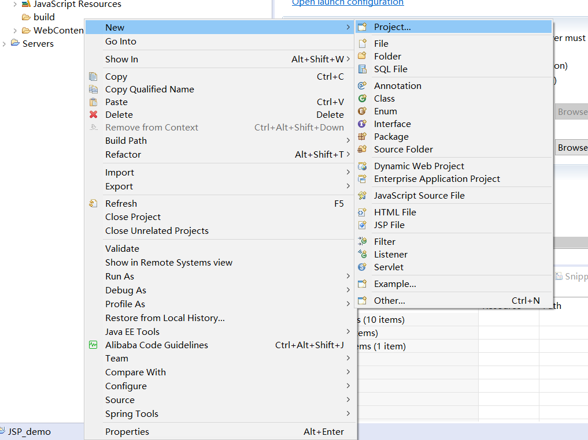
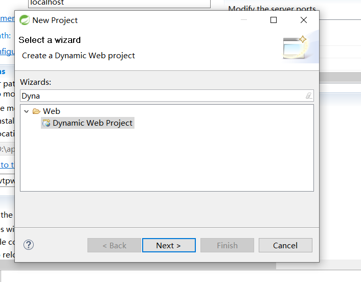

# STS进行搭建
* 一般情况下左键选择`new` -> `Dynamic Web Project` 即可创建JSP项目；如果`new`的二级菜单没有该选项，则用如下方法
* 左键选择`new` -> 点击`Project` 

* 搜索`Dynamic Web Project` -> 选中next

* [有文章介绍](https://blog.csdn.net/x1538644319/article/details/107812929)了在Eclipse中可以从站点进行下载，

