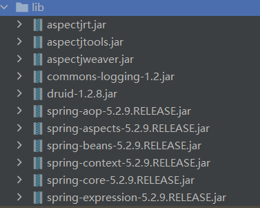

# AOP简介
* 面向切面（方面）编程
* 将入职记录，性能统计，安全控制，事务处理，异常处理等代码从业务逻辑中分离出来
* 说人话：不修改源代码，直接在主干功能中添加新功能
* 底层原理
  * AOP使用动态代理
  * 有接口：JDK动态代理
  * 无接口：CGLIB动态代理

# AOP术语
* 基于以下代码举例
    ```java
    class User{
        add()

        update()

        select()

        delete()
    }
    ```
* 连接点：可以被增强的方法，User类中四个方法都可以被增强，所以四个方法都是连接点
* 切入点：连接点中，实际被增强的方法，叫做接入点
* 通知（增强）：
  * 真正被增强的逻辑部分，称之为通知；希望add方法执行完后，加入**日志记录操作功能**，那么**日志记录的逻辑部分**称之为增强
  * 通知的类型：
    |通知类型|介绍|
    |--|--|
    |前置通知|方法之前执行|
    |后置通知|方法之后执行|
    |环绕通知|方法前后都执行|
    |异常通知|方法出现异常时执行|
    |最终通知|不论方法是否顺利执行完，还是发生异常，都会执行的通知，类似`try..catch..finally`中的`finally`|
* 切面：将通知应用到切入点的过程


# AOP的配置

## AOP插件：AspectJ
* Spring中的AOP是指使用AspectJ插件进行操作，尽管该插件与Spring一起使用，但并不是Spring的组成部分
* AspectJ的两种AOP实现方式：
  * xml文件实现
  * 注解方式实现  

## 引入AspectJ相关依赖
  * Spring中需要的依赖：`spring-aspect`
  * [aspectJ下载地址](https://www.eclipse.org/downloads/download.php?file=/tools/aspectj/aspectj-1.9.6.jar)
    * 下载完成后，解压->打开`file`->打开`lib`将三个jar包添加至依赖（如下图所示）
      * 
    * 下图是Spring AOP所需要的全部依赖
      * 

## 切入点表达式
  * 表达式的作用是知道对哪类的哪个方法进行增强
  * 语法结构
    ```java
    execution([权限修饰符（public private）][返回类型（int void等）][类的全路径（包+名称）][方法名称][参数列表])
    ```
  * 举例1：对com.SpringAOP.JDKProxy.UserDao里面的add进行增强
    ```java
    // * 表示所有权限修饰符
    execution(* com.SpringAOP.JDKProxy.UserDao.add(..))
    ```
  * 举例2：对com.SpringAOP.JDKProxy.UserDao里面的**所有方法**进行增强
    ```java
    // 将 add 替换成 *
    execution(* com.SpringAOP.JDKProxy.UserDao.*(..))
    ```
  * 举例3：对com.SpringAOP.JDKProxy里面***所有类的所有方法**进行增强
    ```java
    // 基于举例2，将 UserDao 替换成 *
    execution(* com.SpringAOP.JDKProxy.*.*(..))
    ```