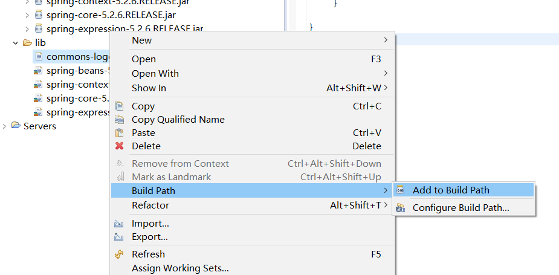
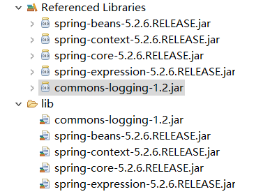

* 轻量级开源的Java EE框架，优点是依赖的jar包小，且该框架可以独立进行使用，将开发任务化繁为简
* 核心部分：IOC和Aop

# Spring相关特点
* 通过IOC控制反转，以前创建对象需要`new`关键词，Spring不需要进行解耦，简化开发
* AOP编程支持：面向切面：不修改源代码的情况下，进行功能增强
* Spring可单独使用，也可与其他框架整合使用
* 降低Java API（如JDBC,事务）的使用难度
* Spring的源码，有很多经典解决方案，值得学习

# Spring 新手村练习

## Spring下载
* 进入[官网](https://repo.spring.io/ui/native/release/org/springframework/spring/)下载Spring jar包，最好下载release版本，因为稳定
* 除了spring jar包，还需要日志 jar包，初学者可使用[common-logging](https://commons.apache.org/proper/commons-logging/download_logging.cgi)进行学习，后期推荐log4j进行深度学习和实际开发
* jar包内的文件会有三种后缀：`.jar`,`-javadoc.jar`以及`-sources.jar`
  * `jar` 就是普通的jar包
  * `-javadoc.jar`说是对应的java文档
  * `-sources.jar`是对应的源代码文件

## Spring导入
* 将所需的jar包放入lib文件夹（项目没有则自行创建），右键选中jar包->build Path -> Add to build path

* 导入成功的jar包会在`Referenced Libraries`中显示

* common-logging需要从[Apache官网进行下载](https://commons.apache.org/proper/commons-logging/download_logging.cgi)，[具体下载教程](https://www.cnblogs.com/mkl34367803/p/14381673.html)

