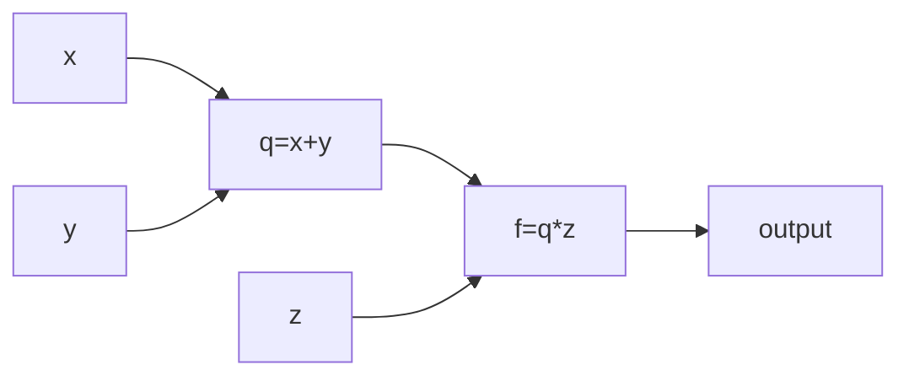
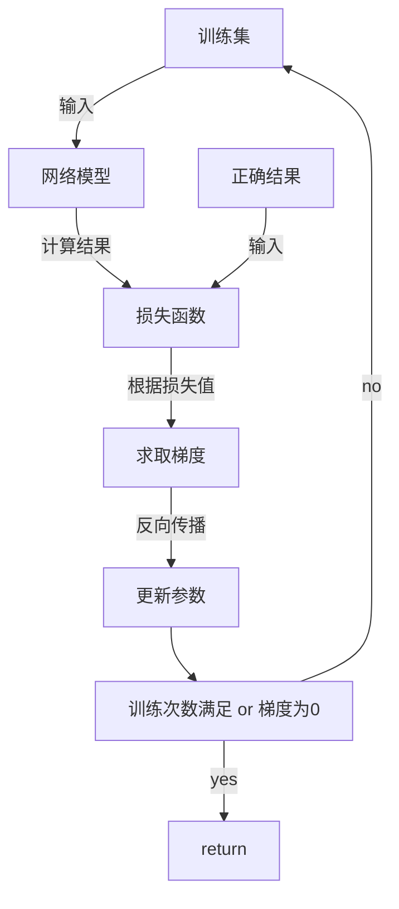

## 损失函数
### 简介
衡量模型根据输入数据给出的预测值（$Y_{predict}$）与真实结果($Y_{true}$)之间差异的函数，是一个非负实值函数。损失函数越小，则证明模型的鲁棒性更好  

在模型的训练阶段，模型计算出预测值，损失函数计算预测值与真实值之间的差，通过**反向传播**去更新各个神经元的参数，来降低预测值与真实值的差异，从而达到学习目的  

### 常见损失函数
因为损失函数用来调整激活函数的权重`w`，故该函数是以权重`w`作为自变量
回归损失：$f(w) = (Y_{predict} - Y_{true})^2$  
分类损失：$f(w) = Y_{true} \cdot log(Y_{predict})$

## 梯度
### 简介
模型训练的目的是通过调整激活函数的权重参数使损失函数最小化，这个最小化的方向（就是权重应该调小还是调大）叫做梯度，该方向通常用向量表示，当损失函数的自变量只有1个时，求最小值的方法是求导；而损失函数的自变量有多个时，求最小值的方法就是偏导 

简而言之，梯度的存在意义就是确定激活函数的权重要增大还是减小
### 如何使用梯度更新权重$w$
1. 损失函数中$w=w_0$处的导数（即梯度）${\Delta}w$，具体的求解方法通过下文**反向传播**实现
2. 更新`w`：$w_{new} = w_0 - \alpha \Delta w$，其中$\alpha$为学习率，$\Delta w$是上一步求得的梯度  
3. 重复以上两个步骤直到损失函数中w得导数为0，即得到损失函数的最小值，w停止更新

## 反向传播
求解梯度的具体方法
复合函数求导 **(链式原则)** : ${f(g(x)) \over dx} = {df \over dg} \cdot {dg \over dx}$
### 举例
神经元函数：$f(x,y,z) = (x+y)z$，本轮输入$x=-2,y=5,z=-4$

1. 对每一个原子函数进行求导/偏导（即有一步操作就求一次）
${dq \over dx} = 1$ ${dq \over dy} = 1$  
${df \over dq} = z$ ${df \over dz} = q$ 
2. 根据**链式原则**，可求出$df \over dx$、$df \over dx$、$df \over dx$（即x、y、z所对应的梯度）
   ${df \over dx} = {df \over dq} \cdot {dq \over dx} = z \cdot 1 = -4$
   ${df \over dy} = {df \over dq} \cdot {dq \over dy} = z \cdot 1 = -4$
   ${df \over dz} = {df \over dz} = q = x+y = 3$
3. 就此，我们得到了x、y、z所对应的梯度，在通过新权重的计算公式$w_{new} = w_0 - \alpha \Delta w$得到三个输入对应的新权重

## 模型训练总结
