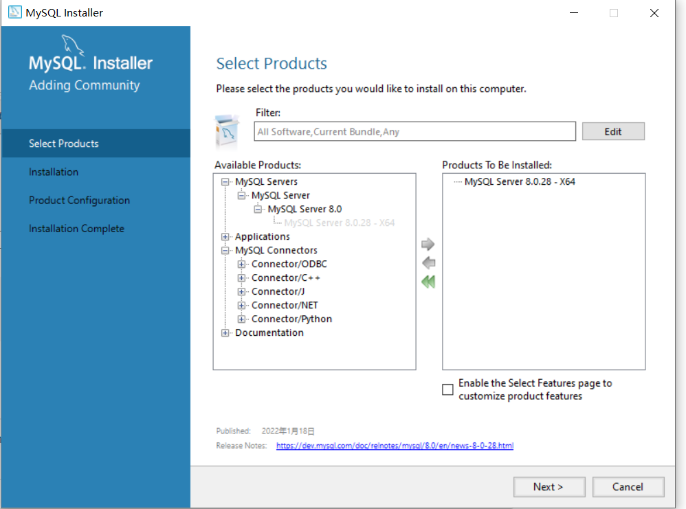
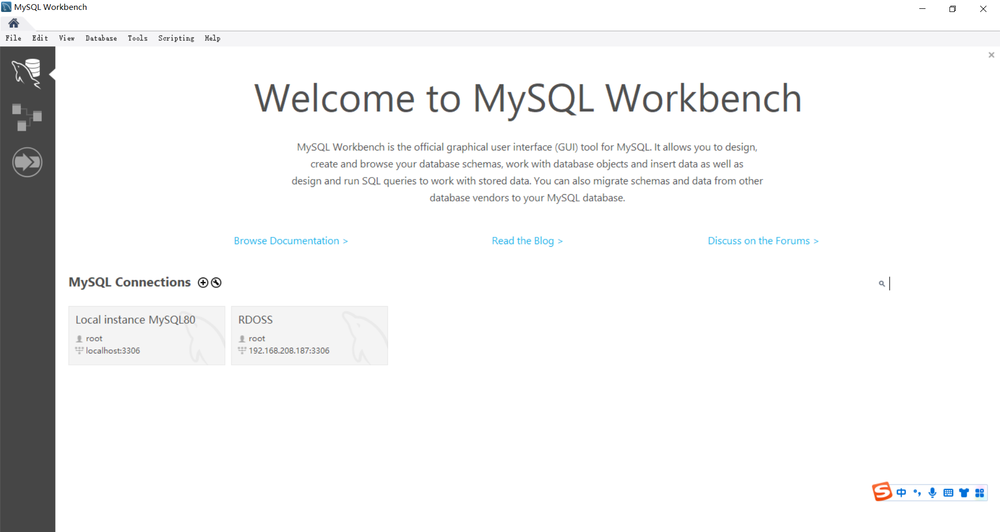
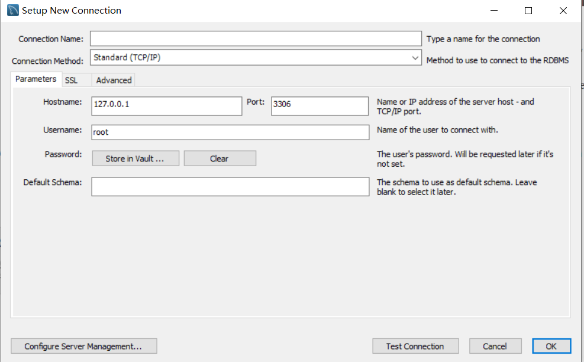
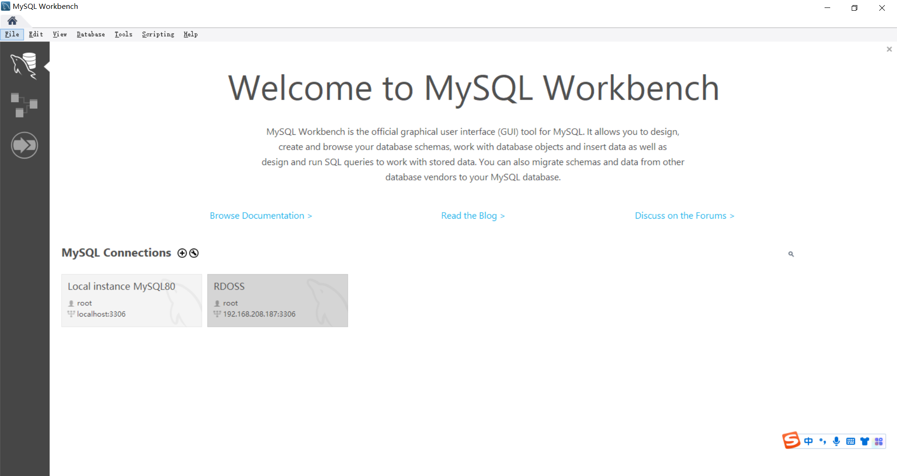
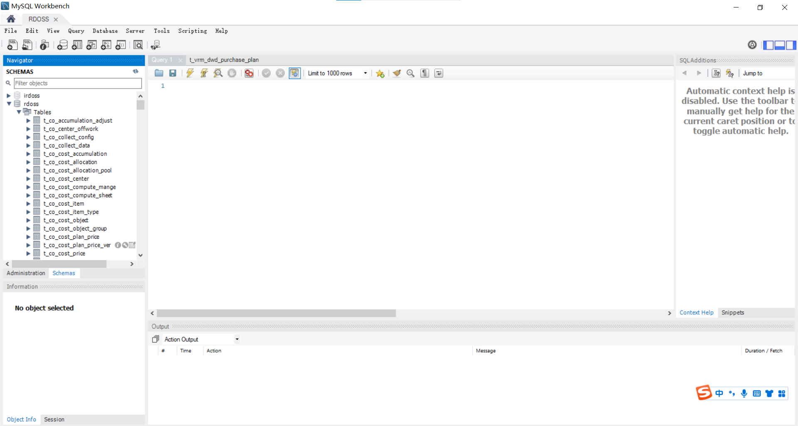
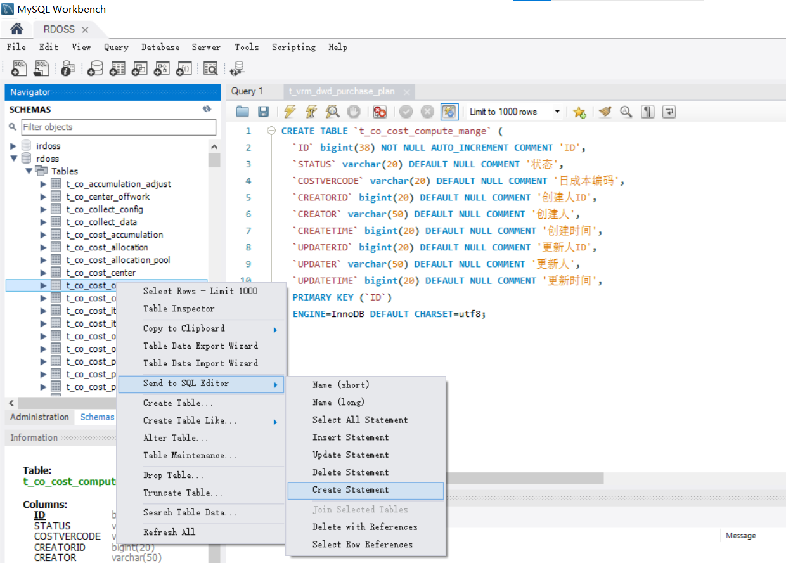
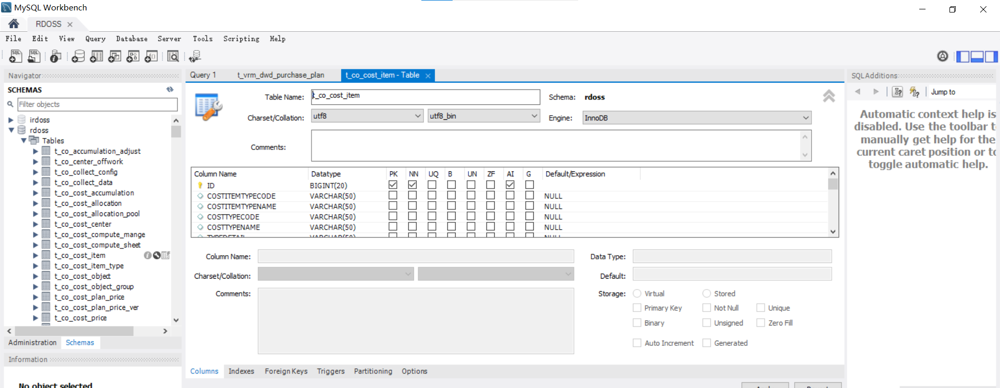
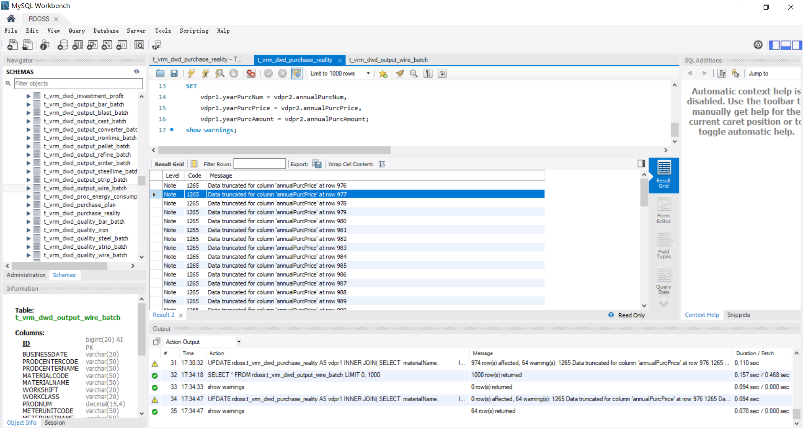
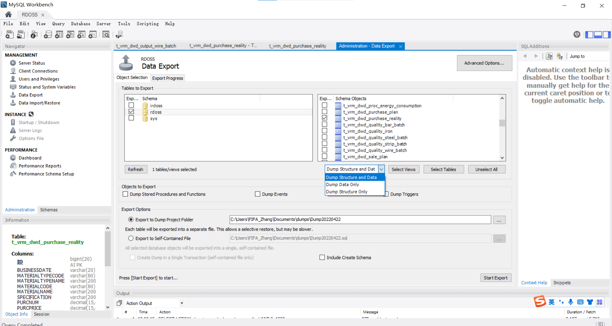

# MySQL Windows安装教程
* [官网](https://dev.mysql.com/downloads/windows/installer/8.0.html)进行下载，下载完毕后直接双击打开进行安装
* 安装流程会让用户去选择希望安装的Products，其中**MySql Server**是启动MySql数据库最基础的、必须安装的Product

# MySql WorkBench
* MySql WorkBench 是MySql数据库的图形化管理工具
## 安装
* 在[官网](https://dev.mysql.com/downloads/workbench/)下载MySql WorkBench
* 安装不多说，一路next即可

## 连接数据库
* 点击 `+` 号添加数据库连接

* 添加数据库的IP、端口号、用户名、密码
* 点击`test connetion`测试连接是否正确

* 配置完成后的主界面会显示已配置的连接，点击进入数据库

* 左侧`Navigator`点击Schemas，可查看数据中的表

## 导出数据表信息
* 导出DDL语句：`Schemas`右键选中表 -> send to SQL Editor -> 表的DDL就会显示在弹窗中

## 更改数据库字段
* 在`Schemas`中选中数据表，点击`小扳手` 按钮
* 该界面会显示该表的所有字段以及对应属性，可对字段进行修改，添加和删除

## 查看日志
* 在sql语句结尾加入`show messages`在执行后自动弹出warning

## 数据库中导出数据
* 左侧导航栏的`Administratior` -> Data Export -> 选择数据库 -> 选择导出的表 -> 选择导出数据 or 表结构 or 两者都要 -> Start Export
