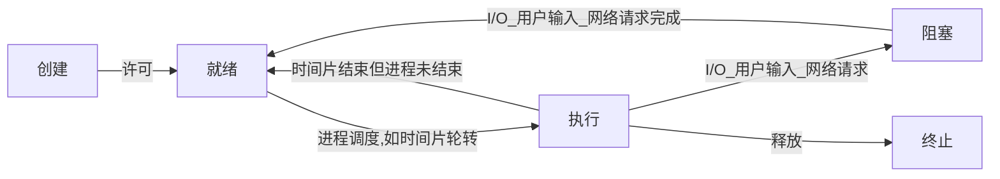

# 进程简介
* 定义计算机中运行的应用程序（微信、QQ、百度网盘等）
* 现在大多数CPU为多核，一个CPU核心可执行一个进程
* 一个进程包含多个线程

# 进程调度
* 多个任务共用一个CPU核心时，各进程的调度
* 目前主流算法：**先来先服务(FCFS)** 、**短作业优先**以及**时间片轮转**
* 时间片轮转：
  * 编号1...n的n个队列，队列编号越大，优先级越低，但队列内进程所需的时间片越长
  * 一个进程被创建 -> 放置1号队列队尾等待被执行 -> 执行时，若该时间片内可执行完，则撤离队列；没有则进入2号队列队尾 -> 以此类推直到在某个队列内被执行完

# 并发&并行
* 并发：单核CPU 或多进程共用一个CPU内核，通过进程调度让多个线程“看起来”像是一起运行
* 并行：CPU多核时，多个进程同时进行
* 并发&并行相同点：都表示多进程处理能力
* 并发&并行区别：多进程处理能力不同，并发是通过时间片轮转，让多个进程“看起来”像是同时执行；并行是真正的多线程同时执行

# 进程状态

|状态名称|说明|
|--|--|
|就绪|进程准备好 & 已分配所需资源|
|执行/运行|在**就绪**状态下被**调度**时，变成运行状态|
|阻塞|由于一些事件（I/O、网络请求、用户input等不使用CPU的事件），无法继续运行；待事件结束后，重新变为就绪状态|
|终止|进程结束 or 发成错误 or 用户停止会进入该状态，无法继续执行|

# 同步&异步
* 同步和异步是CPU遇到阻塞操作时的不同行为（同步是等待，异步就是继续往后走）
* 同步：程序顺序执行，前一步骤执行完毕后，才会执行下一步骤
* 异步：
  * 程序不是顺序执行，而是顺序触发：前一步骤触发后，无需等待是否执行完成，直接启动下一步骤
  * 异步即可基于**并发**也可基于**并行**实现，但大部分是通过并发

# 不同语言对进程的具体实现
* [Python multiprocessing](../../%E6%8A%80%E6%9C%AF%E7%AC%94%E8%AE%B0/Python/Python%E8%AF%AD%E6%B3%95/Python_multiprocessing.md)

# 线程
* 一个进程中含有线程
* 一个进程中的线程共享进程的**内存资源**
* 互斥锁：防止多个线程同时读写同一内存块

# 不同语言对线程的实现
* [Python threading](../../%E6%8A%80%E6%9C%AF%E7%AC%94%E8%AE%B0/Python/Python%E8%AF%AD%E6%B3%95/Python_threading.md)

