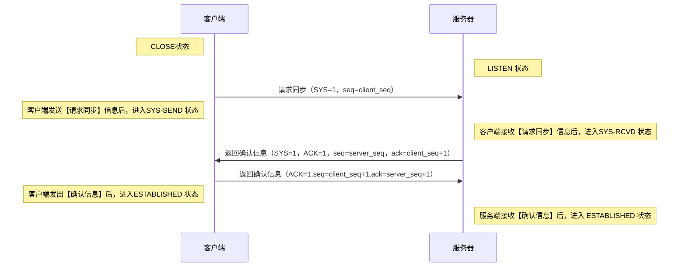

# 网络传输模型

## 7层模型

## 5层模型

## 5层与7层模型的关系

# 应用层

# 传输控制层
* 分为TCP & UDP

## TCP
* 面向**连接**的**可靠（三次握手）**的传输协议

### TCP报文结构

### 三次握手
* 目的：建立安全的连接
* 连接的本质：三次握手后，客户端 & 服务器会开辟资源，这套资源就是一个连接
* 连接的呈现 & 使用形式：开辟的资源以变量形式（socket），提供给程序使用
* socket：
  * 插座、套接字、四元组（原IP地址、原端口号、目标IP地址、目标端口号，该四元组具备唯一性）
  * 交付形式：文件描述符
* 三次握手的流程：

|流程|说明|携带参数|能否携带数据|是否消耗序号|传输方向|状态改变|
|--|--|--|--|--|--|--|
|第一次握手|客户端进程创建传输控制模块（TCB） 向服务器发送连接请求报文|SYN=1 seq（初始序列号）|否|是|客户端 -> 服务端|客户端：SYS-SEND|
|第二次握手|服务端接收后，返回确认信息|SYN=1 ACK=1 seq（初始序列号）|否|是|服务端 -> 客户端|服务端：SYS-RCVD|
|第三次握手|客户端接受信息后，返回确认信息|ACK=1 seq ack|ACK报文段可携带数据|若携带数据，则不消耗序号|客户端 -> 服务端|发出时，客户端：ESTABLISHED 接收后，服务端：ESTABLISHED|

* TCP进行第三次握手的原因：当服务端收到第二次握手信息时，有两种可能：第一种是正常有效的握手信息，第二种是因为各种原因失效的第二次握手信息，服务器无法判断具体是哪种信息，故进行第三次握手确认当前连接仍生效
* 服务器内核心跳机制：三次握手建立连接后，当服务器“掉线”时，客户端不会断开连接(继续保持`keepAlive状态`)，导致客户端资源浪费；服务器内核开启心跳模式，客户端可及时知晓服务器状态

### 四次挥手

# 参考
* [两张动图-彻底明白TCP的三次握手与四次挥手](https://blog.csdn.net/qzcsu/article/details/72861891)