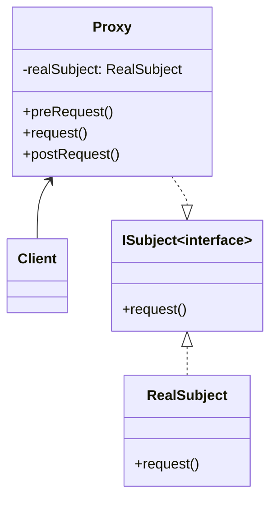
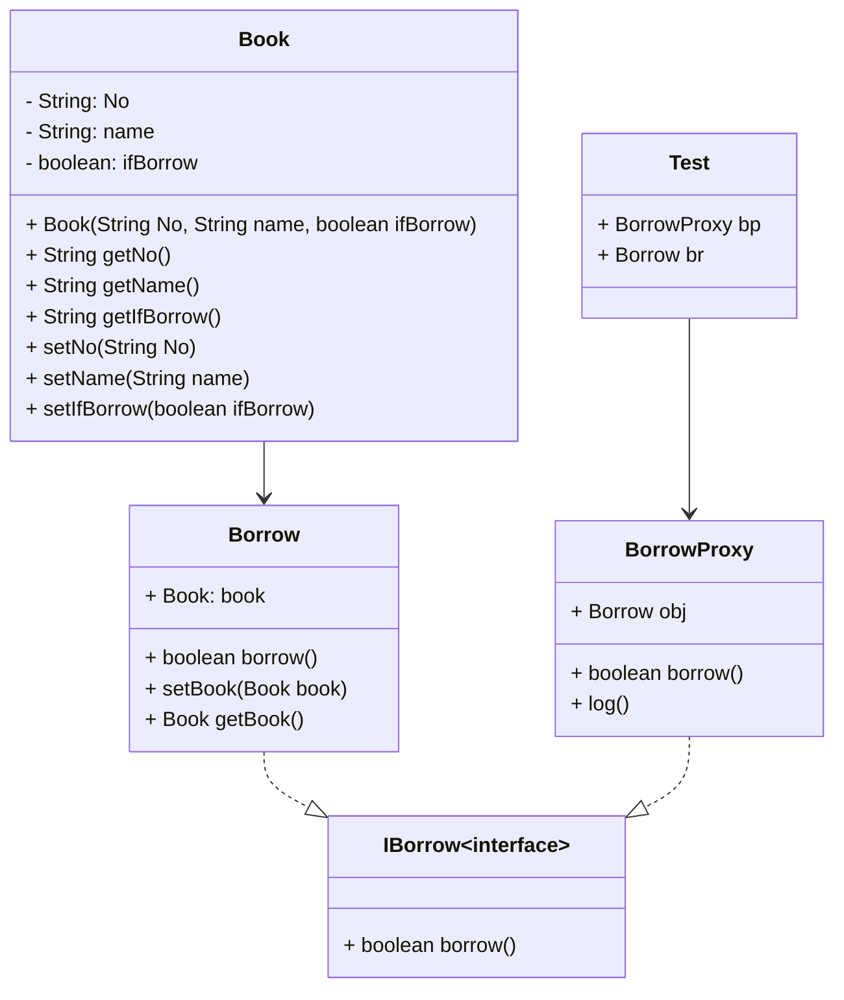
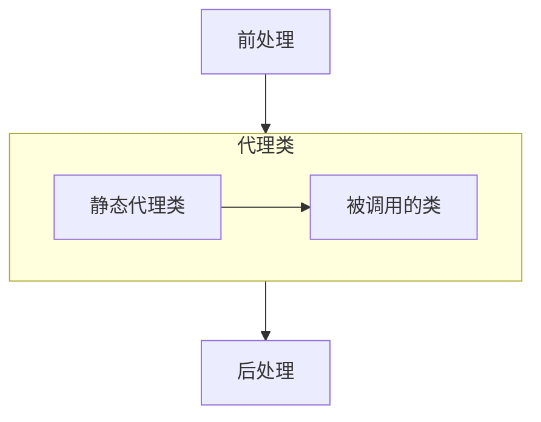
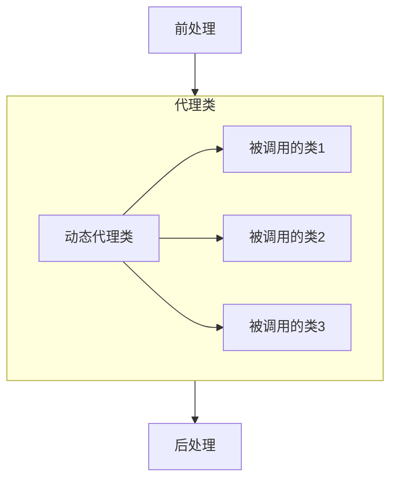

# 什么是代理模式
* 当对象`Client`调用对象`RealSubject`时，`RealSubject`无法被直接调用，而是通过中介(`Proxy`)去进行调用


- `Client`: 调用者
- `ISubject`: 该接口是代理(`Proxy`)和被调用对象（`ISubject`）所共用的接口
- `RealSubject`: `ISubject`的实现类，是真正的被调用者
- `Proxy`: 介于`Client`与`RealSubject`之间的代理  
常规代理有如下几种：虚拟代理、远程代理、计数代理以及动态代理  

# 虚拟代理
虚拟代理的核心是：当被调用的对象资源消耗较大时，可以先创建一个小对象，真实的大对象只有在确定被需要时，才会被创建
## 示例：学生管理系统
* 学生管理系统的表结构如下所示

|字段名|类型|说明|
|--|--|--|
|ID|VarChar(225)|学号|
|UserName|VarChar(225)|学生姓名|
|Resume|varchar(4000)|学生简历|

`ID` 和 `UserName`都较短，而`Resume`字段很长，所以好的查询策略为二级查询：查询时先显示`ID`与`UserName`（一级），当需要查看详情时，再显示资源占用较大的`Resume`（二级）

- 定义抽象接口`IItem`（上文UML中的`ISubject`）
```java
public interface IItem{
    String getID(); void setID(String ID);
    String getUserName(); void setUserName(String UserName);
    void fillResume();  // 用于填入Resume字段内容
}
```

- `IItem`的实现类`RealSubject`（上文UML中的`RealSubject`）
```java
public class RealSubject implements IItem{
    private String ID;
    private String UserName;
    private String Resume;

    public String getID(){return ID;}
    public void setID(String ID){this.ID = ID;}
    public String getUserName(){return UserName;}
    public void setUserName(String UserName){this.UserName = UserName}

    public void fillResume(){
        // 填入Resume字段内容的代码实现
    }  
}
```
- 代理类`ProxyItem`(上文UML中的`Proxy`)
上文已经实现了一级查询与二级查询的方法，但是具体何时调用二级查询，由`Proxy`进行判断，注意：代理类（`ProxyItem`）中的方法需要与接口（`IItem`）保持一致
```java
public class ProxyItem implements IItem{
    private RealSubject realSubject;
    boolean ifFill; // 该变量用于控制是否填入Resume
    public String getID(){
        return realSubject.getID();
    }

    public void setID(String ID){
        this.setID(ID);
    }

    public String getUserName(){
        return realSubject.getUserName();
    }

    public void setUserName(String UserName){
        this.setUserName(UserName);
    }

    public void fillResume(){
        if(!ifFill){
            realSubject.fillResume();
        }
        ifFill = true;
    }  
}
```
`ProxyItem`默认为false，首次调用`fillResume`时会填充Resume，且`ifFill`重置为true；当第二次调用时，Resume相关代码不会被再次调用，节省了大量计算机资源，这样`ProxyItem`代理就实现了对被调用的对象进行控制的这一使命

# 计数代理
方法被调用之前，去运行一些如记录日志、计数等额外操作，这些额外操作是每个模块通用的，不能直接写入被调用的方法中，通过计数代理封装方法
## 示例：图书借阅系统
当图书被借阅时，生成一条log记录，log中写明该书本次借阅时间 & 累计借阅次数
- 图书借阅系统UML如下图所示



- 定义图书类(`Book`)
```java
class Book{
    private String No;  // 书号
    private String name;  // 书名
    private boolean ifBorrow; // 状态（true为正在借阅，false为未借阅）
    public Book(String No, String name, boolean ifBorrow){
        this.No = No;  
        this.name = name;
        this.ifBorrow = ifBorrow;
    }

    public String getNo(){
        return No;
    }

    public String getName(){
        return name;
    }

    public boolean getIfBorrow(){
        return ifBorrow;
    }

    public void setNo(String No){
        this.No = No;
    }

    public void setName(String name){
        this.name = name;
    }

    public void setIfBorrow(boolean ifBorrow){
        this.ifBorrow = ifBorrow;
    }
}
```

- 定义抽象接口`IBorrow`
```java
interface IBorrow{
    boolean borrow(); // 定义借阅的过程
}
```

- 定义借阅实现类`Borrow`
将`Book`进行封装，增加`borrow()`方法：用于改写书本状态(即`Book`的`ifBorrow`属性改为true)
```java
class Borrow implements IBorrow{
    private Book book;
    public void setBook(Book book){
        this.book = book;
    }
    public Book getBook(){
        return book;
    }

    public boolean borrow(){
        // 将book的借阅状态改为true
        book.setIfBorrow(true);
        return true;
    }
}
```
- 定义借阅代理类 `BorrowProxy`
  * 该类中的`Map<String, Integer>map`中，String是书本号，Integer为借阅次数，每次借阅发生时，对应书本号的借阅数+1
  * 该类中的`log`方法，用于保存书本借阅的信息，保存格式：时间+书号+借阅次数
```java
public class BorrowProxy implements IBorrow{
    private Borrow obj;
    private Map<String, Integer> map;  // 记录每本书的借阅次数
    public BorrowProxy(Borrow obj){
        this.obj = obj;
    }

    public boolean borrow(){
        if(!obj.borrow()){
            return false;
        }
        else{
            // 对应书本的借阅次数 + 1
            Book book = obj.getBook();
            Integer i = map.get(book.getNo());
            i = (i == null) ? 1 : i + 1;
        }
    }

    public void log(){
        // 生成log
    }
}
```
log方法没有直接写入borrow中的原因：log的调用时间不一：有的系统需要每天生成一个就好，但是有些是每次借阅生成一个log，所以log的调用会放在主框架下去执行

- 测试类
```java
public class Test{
    public static void main(String[] args){
        Borrow br = new Borrow();
        BorrowProxy bp = new BorrowProxy(br);

        br.setBook(new Book("1", "计算机应用"));
        bp.borrow();  // 借阅 计算机应用

        br.setBook(new Book("2", "Java"));
        bp.borrow();  // 借阅 Java

        bp.log();
    }
}
```

# 动态代理
前文涉及到的代理都是静态代理，代理的都是同一类型（或父类一样）



动态代理则是多个类型，这些类型的父类不一样，但共享**前处理**和**后处理**功能

多种类型代理调用一般是通过反射进行实现