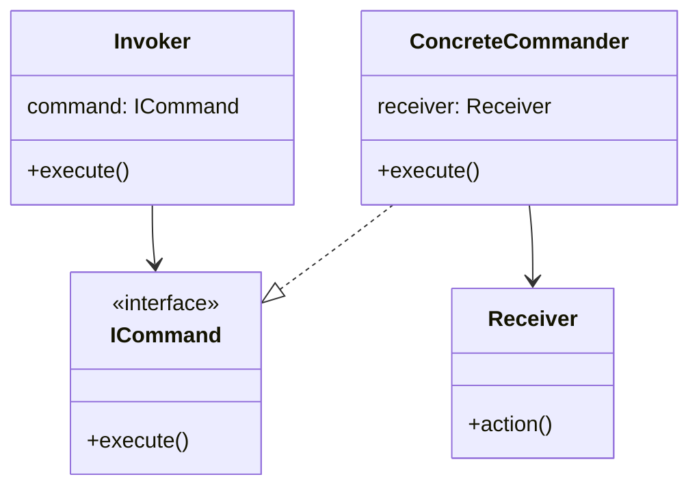

# 命令模式的应用场景
如下场景：老师通知学生打扫卫生，老师(`Teacher`类型)是命令发送者，学生（`Student`）是命令接受者，学生接到命令后，开始打扫(`sweap()方法`)

## 抽象的命令接口(`ICommand`)
- 该类型的子类，才可以发送命令
```java
interface ICommand{
    public void execute(){  // 发送命令

    }
}
```
## 命令接受者（`Student`）

```java
class Student{
    public void sweep(){
        System.out.println("we are SWEEPING the floor")
    }
}
```

## 命令发送者(继承`ICommand`的`Teacher`类型)

```java
class Teacher implements ICommand{
    private Studet receiver = null;
    public Teacher(Student receiver){
        this.receiver = receiver;
    }

    public void execute(){  // 实现ICommand接口的execute
        receiver.sweep();
    }
}
```
## 命令请求者（`Invoke`）
一般情况下，命令下达的沟通链是这样的：老师 -> 学生；加入命令请求者后的沟通链如下：老师（`命令发送者`） -> `Invoke` -> 学生（`命令接受者`）。这样的好处是：`命令发送者`不需要知道命令要发给谁，统统发送至`Invoke`即可；`命令接受者`也不需要知道谁发送过来的命令，直接执行即可，这样在`发送者`和`接受者`之间完成了解耦
```java
class Invoke{
    ICommand command;

    public Invoke(ICommand command){
        this.comand = command;
    }

    public void execute(){
        command.execute();
    }
}
```
- 测试类
```java
public class Test{
    public static void main(String[] args){
        Student s = new Student();  // 定义接收者
        Teacher t = new Teacher();  // 命令发送者
        Invoke i = new Invoke();  // 定义请求者
        invoke.execute();  
    }
}
```
## UML


# 实际应用
- 有若干多边形，根据求解任一多边形面积
## 命令接受者（`PolyonCalc`）
- 用于计算多边形面积
```java
class Point(){
    public Point(float x, float y){
        this.x = x; this.y = y;
    }
}

class PolyonCalc{
    // 输入点的坐标数组，返回面积
    public float getArea(Point pt[]){
        // 计算后返回多边形面积
    }
}
```

## 命令发送者接口（`ICommand`）
- 将命令发送抽象成接口
```java
interface ICommand{
    float calc();
}
```
## 命令发送者的接口实现（`AreaCommand`）
- 实现`ICommand`接口类
```java
class AreaCommand implements ICommand{
    PolyonCal calc;
    Point pt[];
    public AreaCommand(Point pt[], PolyonCalc calc){
        this.pt = pt; this.cacl = calc;
    }
    public float calc(){  // 实现接口的calc方法：调用接受者（PolyonCal）的求取面积方法
        return calc.getArea(pt);
    }
}
```

---
# 现实中的应用实例
- Winform组件，再注册之后才可以使用
- JDK 组件也类似


