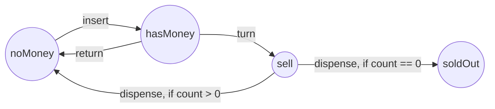
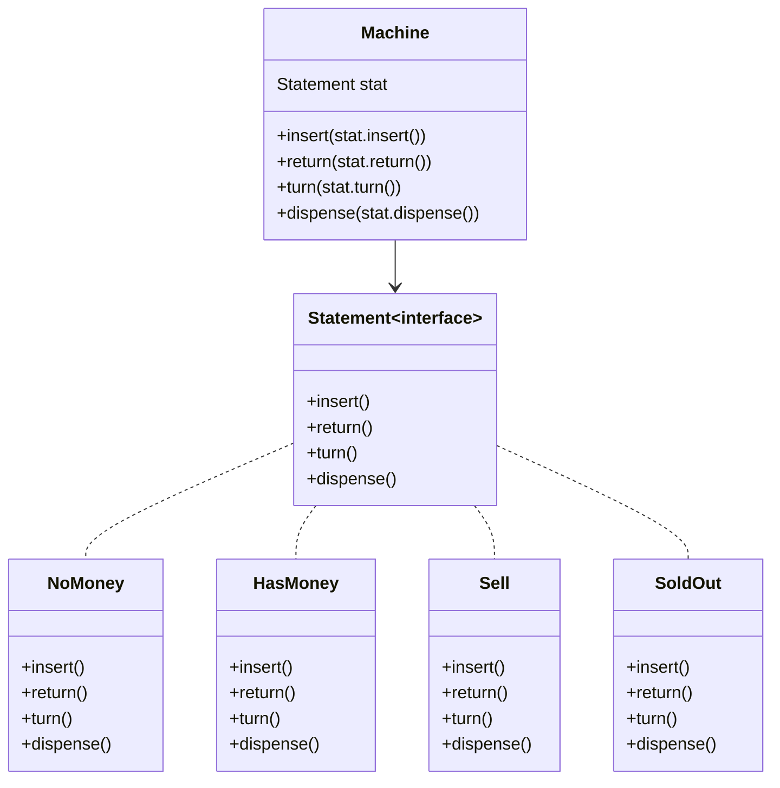

# 状态机简介
- 状态机分为两部分：**状态**，以及转换状态用的**动作**，以售货机举例子


- 里面的每一个方法（`insert()`,`return()`,`dispense()`等），都需要根据其状态去走不同的逻辑，以下是java的简易实现
```java
public class Machine{
    final static int NO_MONEY = 0;
    final static int HAS_MONEY = 1;
    final static int SELL = 2;
    final static int SOLD_OUT = 3;

    private int state = SOLD_OUT;

    public void insert()  // 当前状态为noMoney时 转换为 hasMoney
    {
        if(state == NO_MONEY){
            state = HAS_MONEY;
        }else if(state == HAS_MONEY){       
        }else if(state == SELL){
        }
    }
    public void dispense() // 当前状态为sell时 count == 0 切换为 soldOut； count >0 时 切换为noMoney
    {
        if(state == NO_MONEY){          
        }else if(state == HAS_MONEY){         
        }else if(state == SELL){
            if(count > 0){
                state = NO_MONEY;
            } else if (count == 0){
                state = SOLD_OUT
            }
        }
    }
}
// 剩下的方法也是一样的逻辑
```
- 如果状态很多（20多种），每个动作（即方法）都要相应的添加逻辑，呐工作量巨大
通过观察可以发现：每个状态都需要有`insert`,`return` `turn`  `dispense`这几个方法，如果将状态抽象成一个接口,接口中包含这些方法，不同状态直接继承这些逻辑，且每个子类实现时，只需要专注**自身状态下的方法逻辑而不用管其他子类**


- 状态转换：状态转换的代码放在`machine`类中可以，`Statement`实现类中也可以