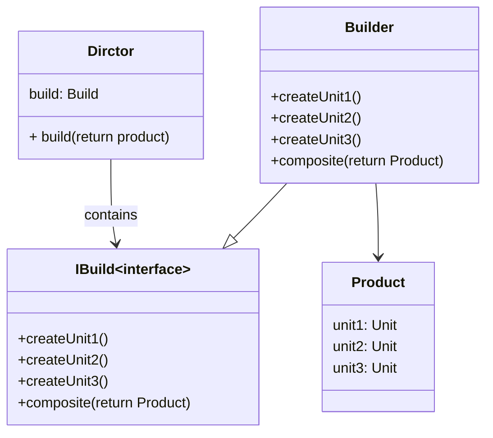
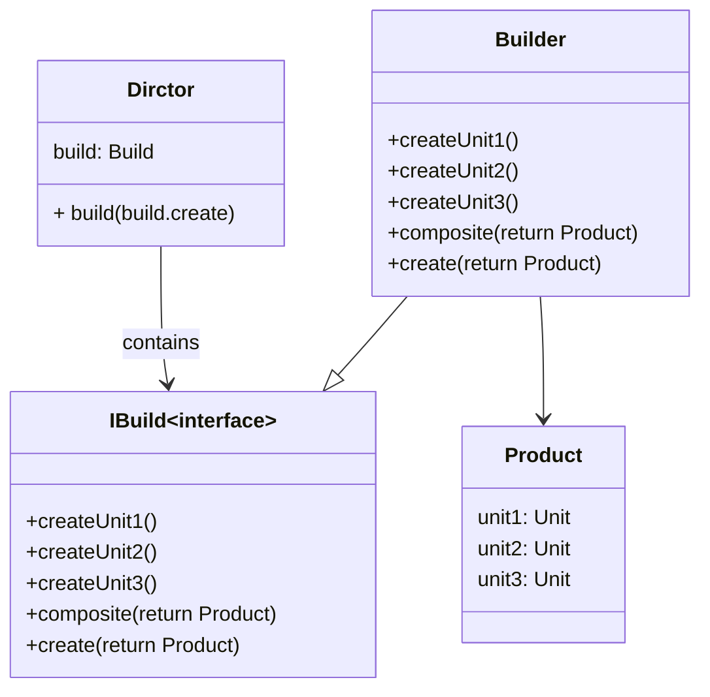

# 生成器的应用场景
- 当实例的创建异常复杂时，将对象的创建与它的表示进行分离
- 如下代码`Product`类是一个复杂的类，初始化需要很复杂的步骤(`createUnit1()` -> `createUnit2()` -> `createUnit3()` -> `composite()` -> 创建完毕)
```java
public class Product
{
    Unit u1;
    Unit u2;
    Unit u3;

    public void createUnit1(){  // 创建具体的单元1

    }

    public void createUnit2(){  // 创建具体的单元2

    }

    public void createUnit3(){  // 创建具体的单元3

    }

    public void composite(){  // 将单元1 ~ 3以某种方式合成具体的Product对象

    }

    public static void main(String []args){
        Product prod = new Product();
        //通过 `createUnit1()` -> `createUnit2()` -> `createUnit3()` -> `composite()` 来初始化Product对象
        p.createUnit1();p.createUnit2();p.createUnit3();p.composite();
    }
}
```
- 创建一个复杂的`Product`类就需要4步，如果还有若干复杂类型`Product1`、`Product2`...呢？代码量将增加很多，此时就需要将构建对象的代码从其他部分分离出来并封装，这就是**生成器模式**

# 生成器模式的实现
- 上部分已经提到了，将构建对象的代码进行分离，所以将`createUnit1()`、`createUnit2()`、`createUnit3()`、`composite()`分离出来
## IBuild类接口的创建
- 因为`Product1`、`Product2`、`Product3`中创建对象的方法（`createUnit1()`、`createUnit2()`、`createUnit3()`、`composite()`）参数相同，返回类型相同，可以将这些方法抽象成一个接口(`IBuild`接口类)，由各个Build类(`BuildProduct1~3`)继承后去实现
```java
// 构建创建对象的接口类
public interface IBuild{
    public void createUnit1();
    public void createUnit2();
    public void createUnit3();
    public Product composite();
}
```
## IBuild的实现类(生成器类)
- `Porduct1`、`Porduct2`、`Porduct3` 继承 `IBuild` 去实现各自的构建对象的逻辑
```java
public class BuildProduct1 implements IBuild{
    Product p = new Product();
    public void createUnit1(){  
        // p.u1 = ....
    }

    public void createUnit2(){  
        // p.u2 = ....
    }

    public void createUnit3(){  
        // p.u3 = ....
    }

    public Product composite(){ 
        // do sth (such as u1 + u2 + u3)
        return p;
    }
}
public class BuildProduct2 implements IBuild{
    Product p = new Product();
    public void createUnit1(){  
    }

    public void createUnit2(){  
    }

    public void createUnit3(){  
    }

    public Product composite(){ 
        // do sth
        return p;
    }
}
// BuildProduct3也是一样，在此省略
```
- 当某个类的构造方法发生改变时，只需修改该类对应的`BuildProduct`类中的逻辑即可

## 定义统一调度类（Director类）
- 该类属于一种**工厂设计模式**：根据输入的生成器类，生成对应的`Product`

```java
public class Director{
    private IBuild build;
    public Director(IBuild build){  // 构造方法将生成器类赋值给调度类
        this.build = build;
    }

    public Product build(){  // 该方法根据生成器类返回对应的Product对象，方法封装了构建对象需执行的函数
        build.createUnit1();
        build.createUnit2();
        build.createUnit3();
        return build.composite();
    }
}

// 测试调用统一调度类
public static void main(String []args){
    IBuild build = new BuildProduct();
    Director dirctor = new Director(build);
    Product p = dirctor.build();
}
```
## UML
- 根据上文可以整理出生成器的UML



# 生成器模式优化
有如下需求：`Product1`的构造需要如下四个方法:`createUnit1()`、`createUnit2()`、`createUnit3()`、`composite()`;而`Product2`仅需要三个方法:`createUnit1()`、`createUnit2()`、`composite()`，但上文中的`Director`类已经将构造逻辑(`build()`方法)进行了固定（即必须按顺序执行`createUnit1()`->`createUnit2()`->`createUnit3()`->`composite()`），故目前的生成器模式无法满足该需求；所以将`build()`方法进一步进行抽象：`IBuild`接口类中加入`create()`方法，返回`Product`类，这样`Product1~3`都可以通过`create()`方法去自定义不同逻辑的对象构造方法
- UML 如图所示


- `IBuild`加入`create()`方法

```java
public interface IBuild{
    public void createUnit1();
    public void createUnit2();
    public void createUnit3();
    public Product composite();
    public Product create();  // 新加入方法：用于创建Product类
}
```
- `IBuild`子类(`BuildProduct1~3`)的实现

```java
public class BuildProduct1 implements IBuild{
    Product p = new Product();
    public void createUnit1(){  
        // p.u1 = ....
    }

    public void createUnit2(){  
        // p.u2 = ....
    }

    public void createUnit3(){  
        // p.u3 = ....
    }

    public Product composite(){ 
        // do sth (such as u1 + u2 + u3)
        return p;
    }
    public Product create(){  // Product1的创建流程：`createUnit1()`->`createUnit2()`->`createUnit3()`->`composite()`
        createUnit1(); createUnit2();createUnit3();
        return composite p
    }
}

public class BuildProduct2 implements IBuild{
    Product p = new Product();
    public void createUnit1(){  
        // p.u1 = ....
    }

    public void createUnit2(){  
        // p.u2 = ....
    }

    public void createUnit3(){  
        // p.u3 = ....
    }

    public Product composite(){ 
        // do sth (such as u1 + u2 + u3)
        return p;
    }
    public Product create(){  // Product2的创建流程：`createUnit1()`->`createUnit2()`->`composite()` 
        createUnit1(); createUnit2();
        return composite p
    }
}
```
- `Director`创建`Product1~3`

```java
public class Director{
    private IBuild build;
    public Director(IBuild build){  // 构造方法将生成器类赋值给调度类
        this.build = build;
    }

    public Product build(){  // 该方法根据生成器类返回对应的Product对象，方法封装了构建对象需执行的函数
        return build.create();
    }
}

// 测试调用统一调度类
public static void main(String []args){
    IBuild build = new BuildProduct();
    Director dirctor = new Director(build);
    Product p = dirctor.build();
}
```