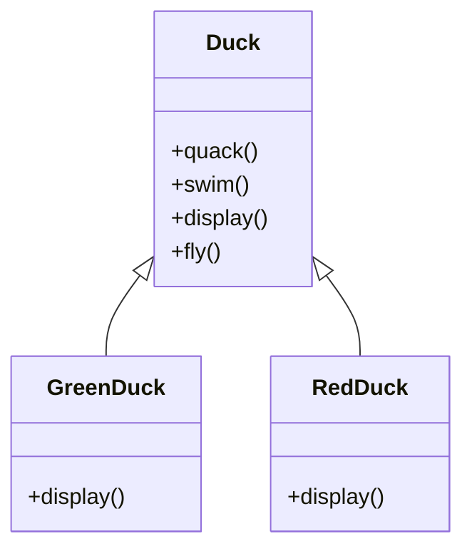
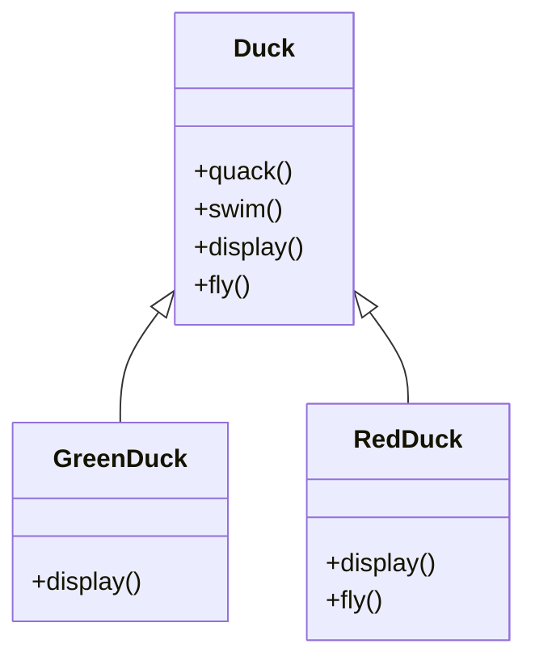
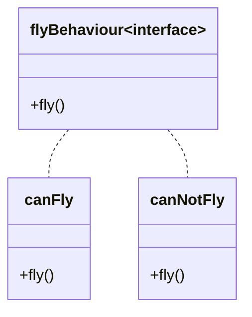
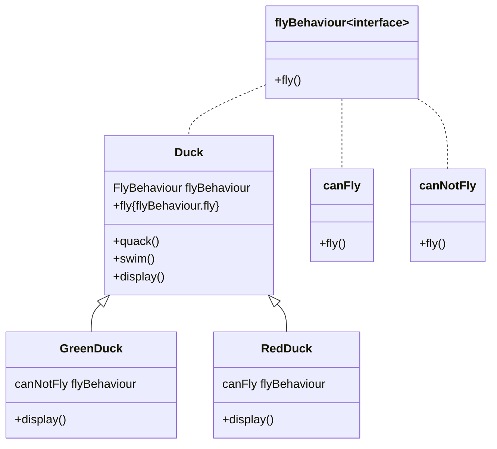

# 简介
- 不同算法类遵循同一接口，使得其他类调用时可随时替换

# 简单例子
- `Duck`为父类，两个子类(`GreenDuck`、`RedDuck`)对其进行继承
- `GreenDuck`、`RedDuck`覆盖父类`display()`方法、

- 后来，加入新需求：`GreenDuck`会飞，但是`RedDuck`不会飞
- 解决方法：`RedDuck`覆盖父类`fly()`方法，里面什么也不做

- 后面又发现问题了：加入了n多不同的鸭子，且有些会飞，有些不会，如果每个不会飞的鸭子都去重写`fly()`，显得太笨重
## 解决方法
- 将**经常变换**的方法(`fly()`)从父类中提取出来，变成接口（`接口名称flyBehaviour`），并通过两个类(`canFly`和`canNotFly`去实现**能飞**和**不能飞**两个功能)

- `Duck`父类创建`flyBehaviour`类型变量，并在`fly()`中调用`flyBehaviour.fly()`;在`Duck`子类中，需要会飞则将`flyBehaviour`实例化为`canFly`;不需要会飞则设置成`canNotFly`即可

# 策略模式思路
- 将类中频繁改变的属性进行提取，变成接口（`flyBehaviour`），根据不同的需求实现接口（`canFly`和`canNotFly`）
- 父类中的属性（`flyBehaviour`）类型为接口类型，子类继承时，直接将该属性根据需求实例化（若鸭子不会飞，则`flyBehaviour`属性实例化为`canNotFly`，会飞则实例化为`canFly`）