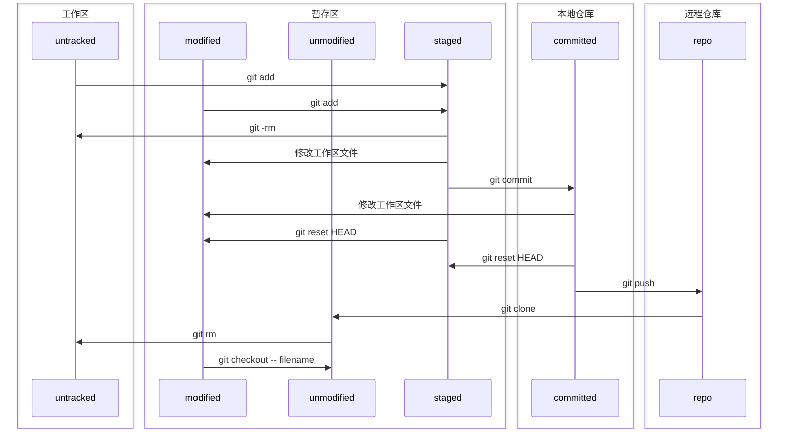

# Git工作区域简介
## **工作区（Working Directory）**
* 该区域在电脑本地，该区域用于开发人员进行项目开发

## **暂存区（Staging Area）**
* 当**工作区**内项目进行了部分改动但未经测试，不宜提交至仓库中时，可先存储至**缓存区**（将增量或修改的内容存储在项目的`.git`路径下），待代码测试合格后，再统一提交至**仓库**
* 或是通过`.gitignore`对文件是否纳入版本控制进行筛选

## **仓库（Repository）**
* 仓库负责管理被托管的项目。每个项目对应一个仓库，仓库除了存放代码，还会记录每一次提交的代码修改，方便进行版本控制。仓库分为**本地仓库（local repo）**以及**远程仓库（remote repo）**
* 本地仓库需和远程仓库进行连接后，才可通过`git push`命令将本地仓库代码提交至远程仓库
### 本地仓库
* 位置在本地电脑上，设置`git config --global user.name "Your Name"`以及`git config --global user.email you@example.com`即可使用
### 远程仓库
* 位置在github、gitee或gitlab等云端仓库，用以实现代码的备份、线上托管以及多人协同开发

## 工作区域通过git命令进行区域转移

  ```mermaid
  graph TD
    working_dir[工作区] -->|通过git add将代码加入暂存区| temp[暂存区];
    temp -->|git commit| local[本地仓库];
    local --> |git push| repo[远程仓库];
  ```
* Github三大工作区域的介绍以及三者的关系就介绍到这里，三个区域的创建以及代码如何在三个区域中进行流转请参考文章后面部分[Github创建首个项目](#github创建首个项目)

# 文件状态简介
|状态名称|所在区域|说明|
|--|--|--|
|Untracked|工作区|未纳入git版本控制|
|Modified|暂存区|纳入版本控制，但暂存区与工作区文件内容不一致|
|Staged|暂存区|该文件有被修改，但目前**工作区**与**暂存区**一致，且只有staged状态文件才可以commit|
|Unmodified|暂存区|该文件没有修改，且目前**工作区**与**暂存区**一致|



# 仓库的操作以及git协作流程
* **创建分支仓库（Fork）**：当用户想将其他人的开源项目做修改以便自己使用时，通过该功能**创建分支仓库**到自己的主页中，该分支仓库包括项目全部代码，且与被分支的项目完全独立（即在分支仓库内的任何修改不会对原有项目产生任何影响），同时可以在该分支上继续分支，各个分支之间互不影响。
* **发起请求（Pull Request）**：书接上文，用户**Fork**一个项目后，进行了修改，发现修改后的项目比原版还要好，你想让更多人受益，可以原版项目**发起请求**。项目创始人收到请求后，会review代码以及测试，对方同意你的修改，便会合并（Merge）到源代码仓库中，那么你对项目的修改就会出现在原版项目代码里了。这就是开源项目的好处，为项目努力的不仅仅是项目创始人，还有许许多多“轮子”的使用者一起优化“轮子”。
* **合并（Merge）**：在对方同意你的pull request之后，会将你的代码合并至源代码仓库中，这个过程就叫Merge。
* **克隆（Clone）**：克隆是将线上的开源项目下载至本地仓库，克隆后的本地仓库除项目代码以外，也包含整个项目的历史版本修改信息，用户也可将修改后的代码直接push到远程仓库。
* **收藏（Star）**：将项目收藏方便下次查看，Star是衡量项目活跃度的其中一个指标，一般来讲收藏的破百，就是个好项目了。除Star之外，活跃度可以根据Issue的数量、前几次发布更新的时间和内容以及StackoverFlow的讨论程度来综合判断项目是否活跃，以防止因第三方轮子停止更新而带来的技术风险。
* **关注（Watch）**：当关注的项目有更新，系统会自动发送更新提醒。
* **问题(Issue)** ：发现了项目中代码BUG或其他问题，且没有找到原因或解决方法时，可以提出一个 **Issue** 用来讨论。  
* 下图呈现了使用github时，整个团队的协作流程：
  ```mermaid
  graph TD
    leader_A[A公司经理本地库] --> |git.push| repo_A[A公司远程库];
    repo_A[A公司远程库] --> |git pull:将远程库的内容拉取至本地库| developer_A[A公司程序员本地库];
    developer_A --> |git push:将代码更新至远程库| repo_A;
    repo_A --> |git fork| repo_B[B公司远程库];
    repo_B --> |git clone 远程库内容克隆至本地,并进行各种配置的初始化 在之后使用pull即可| developer_B[B公司程序员本地库];
    developer_B --> |git push| repo_B;
    repo_B --> |git pull request > A公司review > merge | repo_A;
  ```

# Github创建首个项目
* 在准备上传的项目根目录下，使用`git init`初始化该项目的本地仓库，创建完毕后，通过`ls -al`指令可以看到多了一个文件夹（`.git`）和一个文件（`.gitignore`）。`.git`路径下存储本地项目的版本控制信息，`.gitignore`内写明了项目中不需要进行版本追踪的项目文件（如具体的项目环境依赖、生成的待发布静态网页等程序运行时自动生成的临时性文件）。
* 使用命令`git add .`将已有项目的所有文件放入暂存区中,`git add [filename]`则是将指定文件放入暂存区。
* 使用 `git commit -m ["更新描述"]` 提交暂存区代码至本地仓库。提交完毕后会出现如下信息：  
```bash
n file changed, x insertions(+), y deletions(-)
```
说的是修改+新创建的文件有n个，其中x行被添加，y行被删除。
* `git remote add [简写] [远程仓库url]` 建立本地仓库和远程仓库的连接，这一步骤需要两个参数：`简写`和`远程仓库url`,简写表示该分支的名称，一般为origin，`远程仓库url`是用户github账号下创建的远程仓库链接。
* 使用`git push -u origin master`将本地仓库代码更新至远程仓库。
* 可以使用 `git status`查看目前所处项目分支、每个被修改文件的状态（即文件目前是在工作区、暂存区还是在仓库中）。文件名显示为红色，且显示`untracked files（文件首次创建从未被提交）或changes not staged for commit(文件已提交，但内部修改未提交)`，表明该文件在工作区，未被git管理，使用 `git add filename`添加至暂存区；文件名为绿色且显示`Changes to be committed`，表明文件是在暂存区，可通过`git commit`指令提交至本地库。

## 小问题
目前github支持通过ssh进行安全认证，而不再是用户名称和密码，官网给大家提供了在[本地生成ssh的方法](https://docs.github.com/cn/authentication/connecting-to-github-with-ssh/generating-a-new-ssh-key-and-adding-it-to-the-ssh-agent)以及[将ssh添加到github账户的方法](https://docs.github.com/cn/authentication/connecting-to-github-with-ssh/adding-a-new-ssh-key-to-your-github-account)。还是那句话，能上官网查就尽量去官网


# 幸福的“小插件”
* 在线阅读源码时，Github网站的排版对阅读并不友好，可在url的`github`后加`1s`,即可得到vs code排版,如下图所示：
  
* [Git版本控制的沙盒游戏小网站](https://learngitbranching.js.org/?locale=zh_CN)，在这里可以对基础的git命令进行练习，直观的图形化界面可以对指令有更深的了解。
* [Git文件的4种状态](https://www.cnblogs.com/utank/p/12180531.html)
* [Git之文件的4种状态](https://www.cnblogs.com/StarChen20/p/14016509.html)

