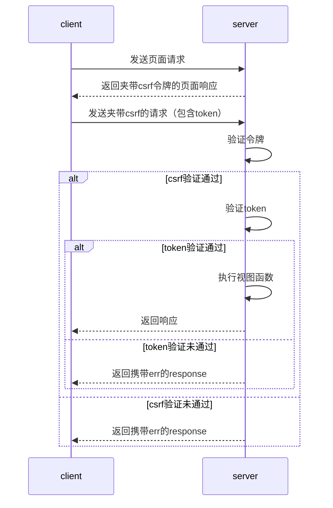
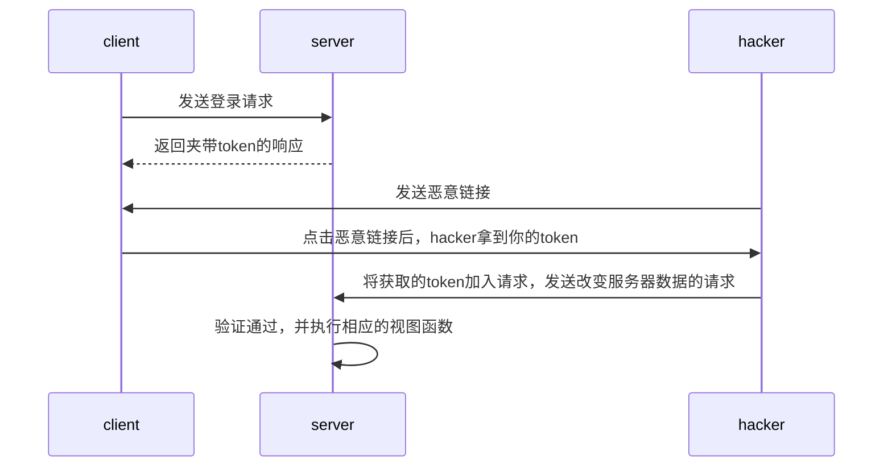

## CSRF保护
跨站点请求伪造保护是一种防范特定类型攻击的机制，当用户尚未从网站注销并继续拥有有效会话时，就会发生这种攻击。在这种情况下，恶意站点可以在登录会话的上下文（cookies）对目标站点执行操作。
<!-- more -->
方法此类攻击，需要保证三件事：
1. 安全的HTTP操作，不能用于更改任何服务器状态和数据，比如：`GET`, `OPTIONS`和`HEAD`
2. 其余不安全的操作，则需要CSRF令牌。
3. 除此之外，还要保证记录回话状态的数据（session，token等）的安全性（加密，设置存活时间）。
Django中，csrf令牌的验证是在中间件内执行的，确切地说，是在中间件的process view中执行，因为中间件要判断路由对应的视图函数是否需要进行令牌验证（Django可通过装饰器局部注销验证）

CSRF保护的流程如图所示：

而跨站攻击就是在没有csrf令牌的保护下，hacker获取会话状态信息来生成对服务器数据或状态改变的http请求

跨站攻击，防御的核心是防止token被挟持
可以通过令牌进行跨站攻击的防御

---
## CORS
一些部署在集群中的微服务，前后端是整体分离的，前端在和后端交互时，因为 ip+port必定不一样，所以就产生了跨站请求。
### 同源策略
同源策略，即前后端的ip和端口号一致时，请求才能成功，不然会有跨站攻击的嫌疑，服务器会禁止这种请求，同源策略从一定程度上避免了跨站攻击，但是这样也影响了正常的前后端分离系统的交互。为了让前后端分离系统的交互能正常进行，则有了CORS。分为简单请求和复杂请求，浏览器会在请求头部自动添加信息，所以只需在服务器实现接口即可。
### 简单请求
1. 方法为head，get，post。
2. 头部不设置除此以外的字段：Accept，Accept-Language，Content-Language，Last-Event-ID，Content-Type（仅限于application/x-www-form-urlencoded、multipart/form-data、text/plain）
3. 以上条件，缺一即为复杂请求
4. 简单请求仅需要一次请求，在头部增加 `Access-Control-Allow-Origin = '域名' 或 '*'`字段即可

### 复杂请求
1. 除简单请求以外的，皆为复杂请求
2. 复杂请求会有两次请求：第一次为OPTIONS方法的预检请求，由于复杂请求时，首先会发送“预检”请求，如果“预检”成功，则发送真实数据。“预检”请求时，允许请求方式则需服务器设置响应头：`Access-Control-Request-Method`和`Access-Control-Request-Headers`

### Django CORS中间件的实现
[django-cors-headers GitHub官方文档](https://github.com/adamchainz/django-cors-headers)

---
## 参考
[Ajax，CSRF&CORS-Django REST框架](https://www.jianshu.com/p/a3a9314067da)
[Django中CSRF防御全过程解析以及中间件作用机制](https://blog.csdn.net/Deft_MKJing/article/details/90348835)
