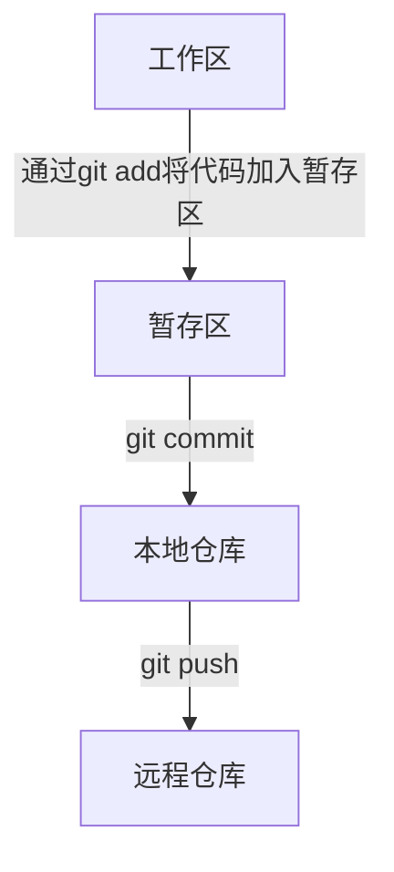
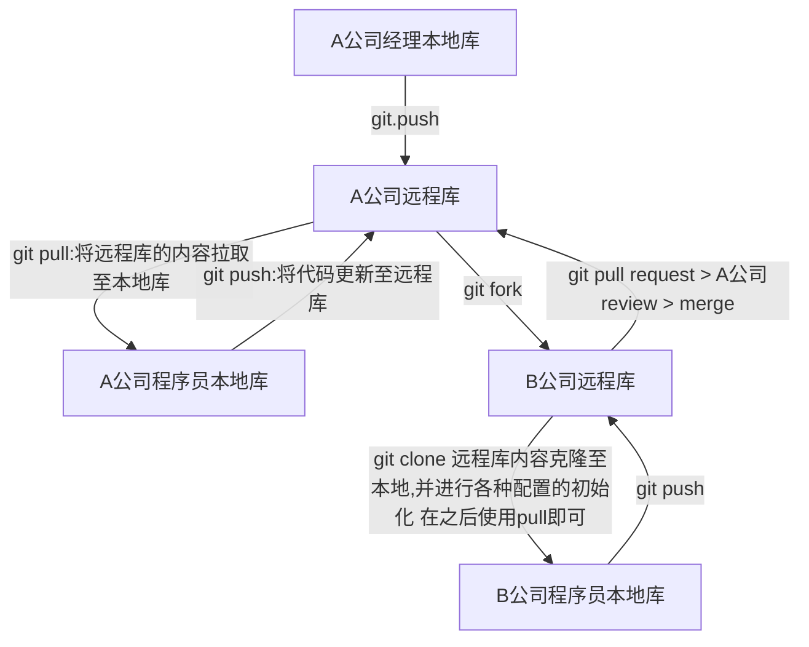

文章简单介绍了Github的专有名词、整体结构以及初始化的用法。
- [基本概念](#基本概念)
  - [Git工作区域简介](#git工作区域简介)
  - [仓库的操作以及git协作流程](#仓库的操作以及git协作流程)
- [Github创建首个项目](#github创建首个项目)
  - [小问题](#小问题)
- [常用Git小命令](#常用git小命令)
  - [`git log` 命令](#git-log-命令)
    - [命令简介](#命令简介)
    - [日志显示的其他几种方式](#日志显示的其他几种方式)
  - [`git reset` 命令](#git-reset-命令)
  - [`git diff` 命令](#git-diff-命令)
  - [](#)
  - [`git rebase` 命令](#git-rebase-命令)
- [幸福的“小插件”](#幸福的小插件)
- [参考文献](#参考文献)
<!--more-->
# 基本概念
对Github中出现的专有名词（尤其是本文中出现的专有名词）进行“入门扫盲级”的介绍，有了解的可以直接跳过。
## Git工作区域简介
* **工作区（Working Directory）**：该区域在电脑本地，对项目代码的修改进行记录和管理。
* **暂存区**：当**工作区**内项目进行了部分改动但未经测试，不宜提交至仓库中时，可先存储至**缓存区**（仍在本地电脑），待代码测试合格后，再统一提交至**仓库**。
* **仓库（Repository）**：仓库负责管理被托管的项目。每个项目对应一个仓库，仓库除了存放代码，还会记录每一次提交的代码修改，方便进行版本控制。仓库分为本地方仓库以及远程仓库，本地仓库在本地电脑上，设置`git config --global user.name "Your Name"`以及`git config --global user.email you@example.com`即可使用。远程仓库即github云端仓库，用以实现代码的备份、线上托管以及多人协同开发。
Github三大工作区域的介绍以及三者的关系就介绍到这里，三个区域的创建以及代码如何在三个区域中进行流转请参考文章后面部分[Github创建首个项目](#github创建首个项目)。
* 以下是git工作区域关系简介：

## 仓库的操作以及git协作流程
* **创建分支仓库（Fork）**：当用户想将其他人的开源项目做修改以便自己使用时，通过该功能**创建分支仓库**到自己的主页中，该分支仓库包括项目全部代码，且与被分支的项目完全独立（即在分支仓库内的任何修改不会对原有项目产生任何影响），同时可以在该分支上继续分支，各个分支之间互不影响。
* **发起请求（Pull Request）**：书接上文，用户**Fork**一个项目后，进行了修改，发现修改后的项目比原版还要好，你想让更多人受益，可以原版项目**发起请求**。项目创始人收到请求后，会review代码以及测试，对方同意你的修改，便会合并（Merge）到源代码仓库中，那么你对项目的修改就会出现在原版项目代码里了。这就是开源项目的好处，为项目努力的不仅仅是项目创始人，还有许许多多“轮子”的使用者一起优化“轮子”。
* **合并（Merge）**：在对方同意你的pull request之后，会将你的代码合并至源代码仓库中，这个过程就叫Merge。
* **克隆（Clone）**：克隆是将线上的开源项目下载至本地仓库，克隆后的本地仓库除项目代码以外，也包含整个项目的历史版本修改信息，用户也可将修改后的代码直接push到远程仓库。
* **收藏（Star）**：将项目收藏方便下次查看，Star是衡量项目活跃度的其中一个指标，一般来讲收藏的破百，就是个好项目了。除Star之外，活跃度可以根据Issue的数量、前几次发布更新的时间和内容以及StackoverFlow的讨论程度来综合判断项目是否活跃，以防止因第三方轮子停止更新而带来的技术风险。
* **关注（Watch）**：当关注的项目有更新，系统会自动发送更新提醒。
* **问题(Issue)**：发现了项目中代码BUG或其他问题，且没有找到原因或解决方法时，可以提出一个**Issue**用来讨论。  
* 下图呈现了使用github时，整个团队的协作流程：

# Github创建首个项目
* 在准备上传的项目根目录下，使用`git init`初始化该项目的本地仓库，创建完毕后，通过`ls -al`指令可以看到多了两个文件：`.git`和`.gitignore`，`.git`负责记录版本控制，`.gitignore`内写明了项目中不需要进行版本控制的项目文件（如具体的项目环境依赖、生成的待发布静态网页等程序运行时自动生成的临时性文件）。
* 使用命令`git add .`将已有项目的所有文件放入暂存区中,`git add [filename]`则是将指定文件放入暂存区。
* 使用 `git commit -m ["更新描述"]` 提交暂存区代码至本地仓库。提交完毕后会出现如下信息：  
```bash
n file changed, x insertions(+), y deletions(-)
```
说的是修改+新创建的文件有n个，其中x行被添加，y行被删除。
* `git remote add [简写] [远程仓库url]` 建立本地仓库和远程仓库的连接，这一步骤需要两个参数：`简写`和`远程仓库url`,简写表示该分支的名称，一般为origin，`远程仓库url`是用户github账号下创建的远程仓库链接。
* 使用`git push -u origin master`将本地仓库代码更新至远程仓库。
* 可以使用 `git status`查看目前所处项目分支、每个被修改文件的状态（即文件目前是在工作区、暂存区还是在仓库中）。文件名显示为红色，且显示`untracked files（文件首次创建从未被提交）或changes not staged for commit(文件已提交，但内部修改未提交)`，表明该文件在工作区，未被git管理，使用 `git add filename`添加至暂存区；文件名为绿色且显示`Changes to be committed`，表明文件是在暂存区，可通过`git commit`指令提交至本地库。
## 小问题
目前github支持通过ssh进行安全认证，而不再是用户名称和密码，官网给大家提供了在[本地生成ssh的方法](https://docs.github.com/cn/authentication/connecting-to-github-with-ssh/generating-a-new-ssh-key-and-adding-it-to-the-ssh-agent)以及[将ssh添加到github账户的方法](https://docs.github.com/cn/authentication/connecting-to-github-with-ssh/adding-a-new-ssh-key-to-your-github-account)。还是那句话，能上官网查就尽量去官网
# 常用Git小命令
## `git log` 命令
### 命令简介
根据commit的时间，由进到远展示每一次commit的索引指针、作者、时间、介绍等信息。
```bash
feifanzhang@fifamba fifa_z_blog % git log
commit 86a730caca26a52c7f320244afa86d0112502820 (HEAD -> master, origin/master, origin/HEAD)
Author: FeifanZhang <zhangff970329@163.com>
Date:   Fri Jul 9 15:21:11 2021 +0800

    gitignore改动

commit 5e7d85cc10965fea595fc5959f313bb56840e191
Author: FeifanZhang <zhangff970329@163.com>
Date:   Fri Jul 9 10:58:06 2021 +0800

    更改主题为Next,增加文章若干
:
```
此时光标会停在最后的`:`后面，`空格键`向后翻页查找更早期记录，`b键`往回翻一页查看近期记录，`q键`退出。  
### 日志显示的其他几种方式
1. 为追求简洁，使用`git log --pretty=oneline`仅显示索引以及commit描述
```bash
feifanzhang@fifamba fifa_z_blog % git log --pretty=oneline
86a730caca26a52c7f320244afa86d0112502820 (HEAD -> master, origin/master, origin/HEAD) gitignore改动
5e7d85cc10965fea595fc5959f313bb56840e191 更改主题为Next,增加文章若干
dce31a051a6819a7338bc9ccc523d3e197c88f2e 1
505fbfd954af9270f6c62b754c94c1936a2233e4 add gallery function in it
53b76ca83c407ac647a9cfb957eba254fe89dadb update
86f66dd41bbfc4daf25a73375faa8be89b5e4b48 add the self-define icarus in github
91f90e9deff4b1074ff107af08960d03ecee2be5 add node_module
846204a4e745bc82965fd4ec5c08de8f5acf6ee2 first commit
```
2. 索引过长，使用`git log --oneline`将索引截取前7位
```bash
feifanzhang@fifamba fifa_z_blog % git log --oneline
86a730c (HEAD -> master, origin/master, origin/HEAD) gitignore改动
5e7d85c 更改主题为Next,增加文章若干
dce31a0 1
505fbfd add gallery function in it
53b76ca update
86f66dd add the self-define icarus in github
91f90e9 add node_module
846204a first commit
```
3. `git reflog` 显示的信息会增加**HEAD@{数字}**意味着退回到该commit版本需要的步数
``` bash
feifanzhang@fifamba fifa_z_blog % git reflog
86a730c (HEAD -> master, origin/master, origin/HEAD) HEAD@{0}: commit: gitignore改动
5e7d85c HEAD@{1}: commit: 更改主题为Next,增加文章若干
dce31a0 HEAD@{2}: clone: from https://github.com/FeifanZhang/fifa_z_blog.git
```
## `git reset` 命令
通过`git log`命令中可查看到每个commit对应的指针索引，reset命令根据这些索引跳转至任意commit版本，（可以使用`git reflog`中的简短索引进行跳转）。对commit的代码进行版本控制，也就是对本地库进行版本控制，但是可能会造成工作区、暂存区与本地库代码版本的不同步，一般通过`hard、mix以及soft参数来确认版本改变的区域`。
1. `git reset --hard`命令：除了重置本地库的版本指针外，还会同步重置工作区以及暂存区版本。
2. `git reset --mix`命令：同步重置暂存区以及本地库，不会对工作区产生影响。
3. `git reset --soft`命令：仅重置本地库，对工作区、暂存区无影响。
## `git diff` 命令
该命令查询工作区、暂存区以及本地库的项目文件的内容差异（diff means differences）。注意：git记录修改信息的最小单位为行。该命令显示的内容包括：文件名称，以及对应文件中的删除的代码以及添加的代码。
1. `git diff`命令：显示工作区与暂存区所有文件的内容差异。
2. `git diff filename` 命令：查看某个文件工作区与暂存区的内容差异。
3. `git diff index filename`命令：显示暂存区与`index`版本本地库的内容差异，index是`git reflog`中的版本指针索引，可查询任何版本本地库与现暂存区的代码差异，如果查询当前版本本地库与暂存区的内容差异，则使用`git diff HEAD filename`即可。
## 
## `git rebase` 命令
# 幸福的“小插件”
* 在线阅读源码时，Github网站的排版对阅读并不友好，可在url的`github`后加`1s`,即可得到vs code排版,如下图所示：
  
* [Git版本控制的沙盒游戏小网站](https://learngitbranching.js.org/?locale=zh_CN)，在这里可以对基础的git命令进行练习，直观的图形化界面可以对指令有更深的了解。
# 参考文献
[bilibili]()

