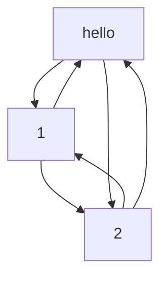

Python的垃圾回收就一句话：引用计数器回收为主，标记清除和分代回收为辅，在此基础上针对不同数据类型进行了回收优化。
# 引用计数器回收
## 环状双向链表refChain
一个双向的环形链表，Python中创建的任何对象都会放在该链表中。
```python
a = "hello"
b = 1
c = 2
d = a  
```
* 首先明确概念：`a、b、c、d、`为对象的引用，`"hello"、1、2`为对象。
* 上面的案例中，`d`引用了`a`的值，为了节省空间，python会让变量`d`直接指向`"hello"`。所以refChain中只有`hello、1、2`这三个对象。创建的对象生成的refchain如下图所示：

## PyObject
PyObject是refchain中每一个对象的结构体类型，为满足环状双向链表而创建，该结构体中包含的属性有：
1. 指向上一个对象的指针：用于构建环状双向链表refChain 
2. 指向下一个对象的指针  
3. 引用计时器：当引用次数为0时，会将该变量自动回收释放占用的资源。  
4. 数据类型：int、float、list等python基础数据类型。 
 
除了PyObject，对于不同数据类型，还需要在该结构体基础上进行扩展来满足不同数据结构的功能，如int、float需要在此基础上增加 val属性来存放数值，list需要增加size属性存放list长度。
## 引用计时器
当某对象被引用次数（结构体内计时器名称为ref_cnt）为0时，该对象会从refChain中移除，释放内存空间，达到回收垃圾的效果。
1. 引用实例
   ```python
   a = 3.14
   b = a  
   # 至此，3.14这个float对象被引用次数为2
   ```
2. 删除引用
   ```python
   a = 3.14
   b = a  # 3.14这个float对象被引用次数为2
   del a  # 删除该引用 应用次数 -1
   del b  # 引用次数 -1 again
   # 至此，引用计时器累数值为0，3.14这个对象会被回收
   ```
3. 计时器+1的情形
   1. 对象被创建
   2. 对象被copy引用时（浅拷贝时）
   3. 对象被作为参数，传入一个函数
   4. 对象作为子元素，存储到容器中（list、dict、tuple、set）
4. 计时器-1的情形
   1. 对象别名被销毁，如`del`命令
   2. 对象引用被赋予新的对象，如`mark = mark1`，`mark`之前引用的对象中，计时器-1
   3. 函数离开作用域，如函数执行完成
   4. 对象所在容器被销毁
## 引用计时器回收的问题：循环引用
发生如下情况：
```python
v1 = [11, 22, 33, 44]  # [11, 22, 33, 44]引用计时器数值为1
v2 = [55, 66, 77, 88]  # [55, 66, 77, 88]引用计时器数值为1
v1.append(v2)  # v2追加至v1中，对象[11, 22, 33, 44]引用计时器数值+1，变为2
v2.append(v1)  # v1追加至v2中，对象[55, 66, 77, 88]引用计时器数值+1，变为2
del v1  # 引用计时器数值-1，变为1
del v2  # 引用计时器数值-1，变为1
```
该引用案例的本意为删除`v1、v2`，并释放二者空间。但执行完del操作后，v1、v2由于互相引用对方而导致引用计时器无法归零，故空间无法释放。为解决该问题，一种辅助方式：**标记清除**被引入。
# 标记清除
## 具体步骤
1. 首先，只有容器类数据（list、dict、tuple、set）会出现相互引用的情况，在refChain的基础上，增加一个存放所有容器类数据的链表
2. 当发现有可能存在循环引用（两者均为容器类型且引用次数为1）时，将两对象划归为死亡容器
3. 遍历其他存活容器，若对死亡容器中的对象有引用，则“复活”之；若无，则删除释放空间
## 标记清除的问题
1. 具体什么时候进行扫描？（虽然是`当发现有可能存在循环引用`时进行扫描，但仍没有具体的时机）
2. 遍历所有存活容器非常耗时  
为解决这两个问题，Python引入了分代回收机制
# 分代回收
该机制解决了`标记清除法`何时扫描的问题，因为将所有对象分成了3代，所以检查循环引用时不用遍历所有元素。将容器类对象维护成三代列表，每一代是一个双向链表：
* 0代链表：对象个数达到700时，遍历一次
* 1代链表：0代扫描10次时，1代遍历一次
* 2代链表：1代扫描10次时，2代遍历一次
## 步骤简介
1. 容器对象创建完毕后，添加至0代链表，当链表内对象数量达到700时，遍历一次，若发现循环引用，该对象引用-1，开启垃圾回收；将不是垃圾的对象升级至1代链表中。
2. 一直重复`步骤1`,直到`0代链表`扫描10次后，扫描1次`1代链表`，对垃圾进行回收，有用的对象升级至`2代链表`。
3. 一直重复`步骤2`,直到`1代链表`扫描10次后，扫描1次`2代链表`，对垃圾进行回收。
# 小结
1. Python创建一个refChain来存储所有创建的对象，每种类型的对象中，存在`ob_refcnt`维护引用次数。当引用计数器变为0时，则进行垃圾回收（对象销毁，refChain中移除，释放资源）。
2. 多个元素组成的对象（容器类对象），可能存在循环引用的问题，故Python引入了`标记清除和分代回收`。共维护4个列表：
   * refChain
   * 0代链表
   * 1代链表
   * 2代链表
当达到各自阈值时，触发遍历链表、标记以及清除的动作。
3. 在Python内部，在此基础上进行了优化：缓存机制
# 缓存机制
## 缓存池（对int进行优化）
Python为避免高频率的创建销毁常用对象，在启动解释器时，在内存创建常用值（`-5 ~ 257`的整数，称为小数据池）放入缓存池，池中对象不会被销毁，即引用计时器永不为0。
```python
val0 = 1
val1 = 2
val2 = 2
# 以上这些常用值，python不会为其开辟新空间存储，直接从缓存池中获取加入refChain中。
# val1 val2被赋值为2，2是从缓存池中拿到的，所以2者指向的地址相同。
```
## free_list机制（对float、list、tuple、dict进行优化）
引用计数器为0时，按道理应当回收，但Python内部会将其添加至`free_list`中作为缓存，以后再创建相同对象时，直接调用
```python
pi = 3.1415926 # 开辟空间，存储float对象，refChain balabala的创建
del pi # 引用计数器变为0，refChain中移除，判断free_list是否已满，若没满则将对象加入至free_list中
pi2 = 3.1415926 # 从free_list中拿出之前的对象3.1415926，在加入refChain创建那一套事情
```
free_list有最大值限制，若缓冲池已满，则对准备加入的对象进行销毁，不同类型对象，free_list的特性不一：
1. float：维护一个最多缓存100个float对象的链表
2. int：缓存池中有介绍
3. str：
   * free_list维护一个ASCII码的字符池，以后使用时不会重复创建（类似于int的缓存池）
   * 驻留机制：若要销毁的字符串长度 <= 20，且仅含有字母、数字、下划线，则该对象不会删除，而是存在内存
4. list：维护一个最多缓存80个list对象的数组
5. tuple：维护一个最多20个元素的数组，每个元素是一个链表。第0个元素存放有0个元素的tuple，第一个元素存放有1个....最后一个（即第19个）存放有19个元素的tuple。每一个元素（及链表可以存放元组的个数为2000）
   ```python
   v1 = (1,2)
   del v1  # 放入free_list[len(v1)]中
   v2 = ("hello", "python")
   del v2  # 放入free_list[len(v2)]中，v1 v2长度相等，所以都放在free_list[2]这个里面。
   v3 = ("aha","a", "ha")
   del v3 # 放入free_list[3]中
   ```
6. dict：最多缓存80个dict对象


