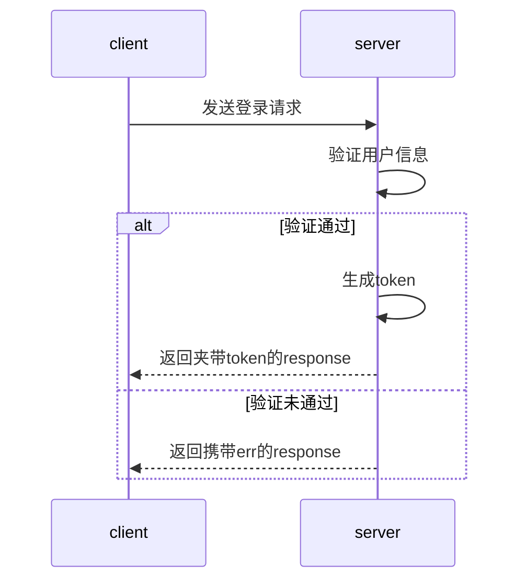
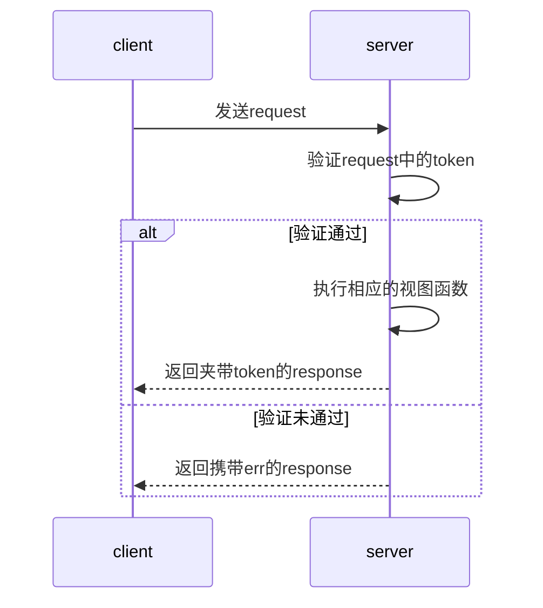

HTTP协议是无状态协议，但是在用户操作时，需要通过用户的状态来进行不同的操作（比如登录与非登录的用户界面，功能不一样），token是解决这一问题的一种方法（还有session），其原理是在`request`中记录用户的状态（登录，未登录）。
<!-- more -->
## 一：token生成：
### 基本流程
如果通过用户信息验证，则生成一个`token`存储在`response`里，每一次访问server时，通过`token`确认是否是登录的用户。
token的生成原理如下图所示

### 具体实现
为了保证每一次登录生成的token都不一样，我选择将登录时间和用户名同时作为token参数
```python
def md5(username: str) -> str:
    import hashlib  # 局部引入md5加密算法
    import time
    ctime = str(time.time())  # 生成时间戳
    m = hashlib.md5(bytes(username, encoding='utf-8'))  # username进行md5加密
    m.update(bytes(ctime, encoding='utf-8'))  # 加入时间戳加密
    return m.hexdigest()
```
## 二：token原理：
### 基本流程
由于http协议自身无状态参数，通过token来记录当前用户的状态。可存放在cookie, body或是url（可能会有浏览器不支持或禁用cookie）。
token的应用流程如下图所示：

### 具体实现
验证`token`时，加入对`token`的时间判断，如果和上一次访问时间差距过大（可能是非法攻击），则需要重新登录。
```python
def confirm(self, *args, **kwargs):
    try:
        token = Token.objects.get(token=kwargs["token"])  # token和user是一对一关系，所以用get
        if (timezone.now() - token.last_op_time).seconds >= 30*60:  # 判断距离上一次访问是否超过30分钟
            raise exceptions.AuthenticationFailed("the token expired, login again")
        else:
            token.save()  # token里的时间属性带有auto_now字段，通过save可以激活时间属性自动更新时间
    except Exception as e:
        raise exceptions.AuthenticationFailed(e.args)
    return token
```
## 三：通过REST Framework实现token认证
### REST Framework如何简化认证流程
通常情况下，需要在每一个视图函数中都加入认证的方法，复杂项目中，某些视图函数会有多个认证，而有的函数则不需要。REST Framework给了我们管理这些认证的方法。在`APIView`源码中，有一个变量叫做`authentication_classes`的list变量：
```python APIView部分源码
authentication_classes = api_settings.DEFAULT_AUTHENTICATION_CLASSES
```
而`api_settings`则是加载Django的setting文件中，REST Framework设置：
```python api_settings部分源码
api_settings = APISettings(None, DEFAULTS, IMPORT_STRINGS)

def reload_api_settings(*args, **kwargs):
    setting = kwargs['setting']
    if setting == 'REST_FRAMEWORK':
        api_settings.reload()
```
```python Django settings文件内REST Framework的设置
REST_FRAMEWORK = {
    "DEFAULT_AUTHENTICATION_CLASSES": ['utils.auth.Authentication', ]
}
```
所以`authentication_classes`是加载Django setting文件内设置的类。
`self.dispatch()`-> `initialize_request()`中的`get_authenticators`方法，会将authentication_classes里面的若干个类实例化去执行。所以在视图函数的类中，自定义`authentication_classes`来让REST Framework去初始化并执行需要的认证类。如果认证通过，则j执行视图函数，有问题则抛出异常。
将认证类封装到同一个`.py`文件易于管理和调用。
```python Authentication类的实现
from loginapp import models
from rest_framework import exceptions
from rest_framework.authentication import BaseAuthentication


class Authentication(BaseAuthentication):

    def authenticate(self, request):
        token = request._request.GET.get('token')
        token_result = models.Token.objects.confirm(token=token)
        if not token_result:
            raise exceptions.AuthenticationFailed("user confirm failed")
        else:
            return (token_result.user, token_result)

    def authenticate_header(self, request):
        pass
```
`BaseAuthentication`是REST Framework的验证类，要实现认证必须继承它，并实现其中的`authenticate`和`authenticate_header`方法：
```python BasicAuthentication源码
class BasicAuthentication(BaseAuthentication):
    """
    HTTP Basic authentication against username/password.
    """
    www_authenticate_realm = 'api'
    # 此方法实现认证在子类必须重写的方法
    def authenticate(self, request):
        """
        Returns a `User` if a correct username and password have been supplied
        using HTTP Basic authentication.  Otherwise returns `None`.
        """
        auth = get_authorization_header(request).split()

        if not auth or auth[0].lower() != b'basic':
            return None

        if len(auth) == 1:
            msg = _('Invalid basic header. No credentials provided.')
            raise exceptions.AuthenticationFailed(msg)
        elif len(auth) > 2:
            msg = _('Invalid basic header. Credentials string should not contain spaces.')
            raise exceptions.AuthenticationFailed(msg)

        try:
            auth_parts = base64.b64decode(auth[1]).decode(HTTP_HEADER_ENCODING).partition(':')
        except (TypeError, UnicodeDecodeError, binascii.Error):
            msg = _('Invalid basic header. Credentials not correctly base64 encoded.')
            raise exceptions.AuthenticationFailed(msg)

        userid, password = auth_parts[0], auth_parts[2]
        # 最后一步中，看出要返回的是一个元祖：(user,token)，并将其封装在request中
        return self.authenticate_credentials(userid, password, request)

    def authenticate_credentials(self, userid, password, request=None):
        """
        Authenticate the userid and password against username and password
        with optional request for context.
        """
        credentials = {
            get_user_model().USERNAME_FIELD: userid,
            'password': password
        }
        user = authenticate(request=request, **credentials)

        if user is None:
            raise exceptions.AuthenticationFailed(_('Invalid username/password.'))

        if not user.is_active:
            raise exceptions.AuthenticationFailed(_('User inactive or deleted.'))

        return (user, None)
        
    # 此方法实现认证在子类必须重写的方法（在方法内部直接写pass即可）
    def authenticate_header(self, request):
        return 'Basic realm="%s"' % self.www_authenticate_realm
```
与`BaseAuthentication`同级的还有若干REST Framework封装好的验证类：`TokenAuthentication`，`SessionAuthentication`以及 `BasicAuthentication`，但是功能单一，不推荐使用。
需要调用认证时在视图函数的类中直接初始化`authentication_classes`即可
```python 调用认证
# 在登录时，因为还没生成token所以局部取消认证，
# 取消认证就是让 authentication_classes内部为空
authentication_classes = []
# 添加认证，就在authentication_classes内部添加即可
authentication_classes = [Authentication]
```
