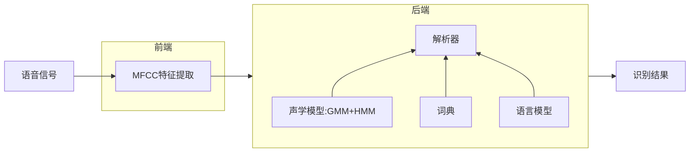
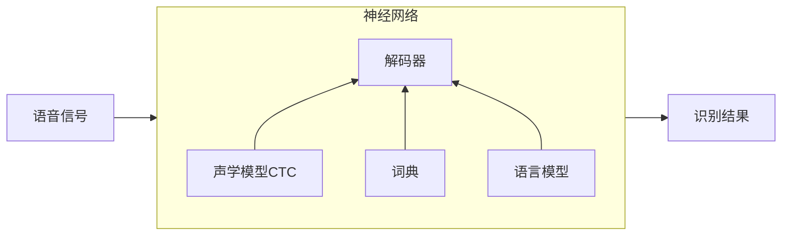
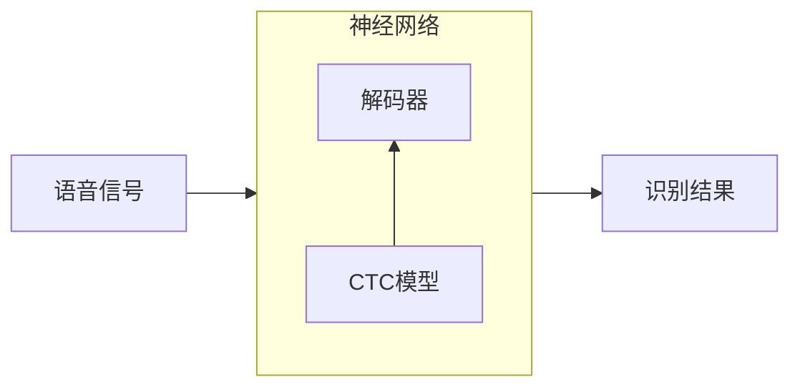

# 语音识别简介
* 定义：将人类语音中的词汇内容转换为计算机可读的输入（如按键、二进制编码或字符序列）
* 涉及的相关课题：
  * 元数据识别：及说话人的语种、年龄、性别、说话的情感
  * 语音增强与分离：环境噪音很大时，如何减少噪音或增强说话人的语音
  * 语音合成与转换：合成是将文字转换为语音，转换是将一个人的声音变为另一个人的声音
  * 自然语言理解、对话系统
* 应用场景：小爱同学、google map、Amazon echo
# 语音识别的发展历程
## 孤立词识别
输入一个词的语音，系统进行识别
  * 模板比较法：
    * 将待识别的语音与语音库中的模型进行比较，哪一个更加相似（距离更小）即为结果。
    * 首先特征提取：将语音信号切片，一帧切片20~50ms，一帧满足如下特征：包含人发声震动2-3个周期，且在一个音素之内。
    * 其次信号处理：傅里叶变换，分析一帧中的低频和高频成分得出频谱，频谱包含精细结构和包络，精细结构反应音高，包络反应音色。
    * 过滤精细结构，留下包络特征：在傅里叶变换基础上，进行三角滤波过滤出包络信息；为了方便后期计算，通过离散余弦变换，提取13个包络特征点，称为MFCC序列（但MFCC缺点是可分析的语音长度小、受噪声、回声以及周围环境的影响严重）
    * 测量特征距离（动态弯算法）：让待识别的语音与模板中最相似的一帧进行匹配（保持每一帧的顺序不变），总距离为各帧欧氏距离之和。
    * 但现在因为神经网络的兴起而落寞
  * GMM：80年代~21世纪初的主流模型
    * 每个人说话的语气，声调都不一样，为了保证识别的准确性，会录制多个对比的模板。但模板一多，对比的计算量陡增。为了减小计算量，将模板合并成为模型的过程称为GMM（高斯混合模型）
      * 将若干模板切片，并将同一特征（即同一音素）的切片进行合并，用高斯分布叠加拟合出每个合并切片中向量特征（即包络特征点）的分布，对任意特征向量，可以给出概率密度。
      * 如何识别未知语音：不再计算欧氏距离，而是计算识别语音的包络特征点在模型中的概率密度。
## 连续语音识别：
  * 将单词的声学模型串起来，即可得到句子的声学模型
  * 语言模型：直到一句话的前半句，来猜下一个词的内容，该模型需要收集很多数据进行归类。如果要猜的内容和前半句的最后1个字有关，则称为bigram（2-gram）,2个词则称为tirgram（3-gram），以音素为最小的单位训练模型，根据词典将音素拼接成单词，单词与语言模型复合成为可进行匹配计算的模板
## 语音识别架构

## 评价指标
* 词错误率：
  * 将标准答案与识别结果对其，将错误、删除、替换的词语总数除以标准答案总长度
  * 缺点：只考虑问题单词的错误个数，而不考虑单词错误的严重性。
  * 目前使用较多的测试集是switchBoard，微软可达到5.9%的错误率水平，IBM目前是5.5%
# 语音识别的现状
* 模型简洁，容易训练和使用
* 理想状态下的性能可与人类媲美
* 恶劣条件下识别较差：噪声、传播损耗（如手机，电话传播）、口音
## 神经网络：
一个有输入输出的复杂函数，基本结构是神经元 
* 公式为：$y= \sigma (w_1x_1 + w_2x_2 + w_3x_3 + b)$，其中$w_n$是权重、$\sigma是$ 非线性函数，又称为激活函数、b是偏置量
###  神经网络的作用：
* 回归计算：输出任意实数，但尽量接近标准答案
* 两类判决：输出概率，尽量接近标准答案
* 多类判决：给出多项分布，但是标准答案的分布最大
### 神经网络的发展
* 大数据的发展：以前没有这么多标准化数据可供模型进行训练
* 算力的发展：尤其是GPU的出现，使计算机计算矩阵与向量的能力大幅提升。
### 如何训练神经网络
* 设计损失函数
* 梯度下降法
* 反向传播
### 前馈神经网络
  * 将若干的一层神经网络（$y=\sigma(W_x+b)$）进行层叠，可得到前馈神经网络
  * 公式：$y=\sigma_3(W_3\sigma_2(W_2\sigma_1(W_1x+b_1)+b_2)+b_3)$
  * 多层非线性特征让其拥有强大的拟合能力，但需要大量数据的训练
#### tandem结构
将特征提取用DNN代替
* 输入参数：
  * 连续若干帧的三角滤波输出（即三角滤波过滤后的包络特征信息）
  * 或者直接输入未处理过的波形，让神经网络自己想办法
* 输出参数：
  * 上下文有关音素：多类判别问题
  * 标准答案由GMM+HMM系统提供
  * 因为神经网络是多层结构，每一层的维度数量不一，会抽取维度值较小的一层作为网络代替前端MFCC
#### Hydrid结构
除了tandem中用取代MFCC之外，对GMM结构也进行替代，成品系统中没有GMM，但需要GMM+HMM提供标准答案
### 循环神经网络
由于HMM对上下文的建模能力有限，在HMM中，下一个状态只与当前状态有关，没考虑前面若干状态对下一状态的影响。如下是一些补救措施
* 补救措施：
  * MFCC中加入差分：即往前看几帧，来判断对当前的影响
  * DNN声学模型输入：不仅输入一帧的包络信息，而是输入连续若干帧的包络信息，让神经网络判断上下文信息
  * 上下文有关的声学模型
* 毕竟以上都是原有基础上的补救措施，并不能有质的提高，采用双向循环网络代替HMM是彻底解决上下文联系不足的方法
* 双向循环网络（RNN）
  * 该网络的特点是：各帧之间的神经元是双向链接的，所以每一帧中，各个模型层级之间的权重$W_n$和偏置$b$会受到前后帧的互相影响，这就促成了上下文联系
* 循环神经网络遇到的问题
  * 梯度不可控：以往的识别模型，反向传播时，梯度逐层往下传递，而在RNN中，由于神经元之间的联系密切，梯度可能会向四边八方的神经元进行传递，导致其失控。
  * 解决方式：LSTM/GRU(极其复杂的非线性函数)  
### CTC
* 不再进行逐帧判别，大部分帧输出为空，只要求输出的音素串与标准答案相同即可。
  * 例如：普通声学模型，进行逐帧分析后，得到的输出为`p p p i i k k k a a ch ch u u u u`，而CTC进行输出后，得到的是`p - - - i - k - - - a ch - - - u -`
* CTC假设不再考虑各帧之间的上下文影响，因为CTC配合RNN使用，而上下文已有RNN进行处理，故不需要HMM进行状态转移的建模了，也就是说不再需要HMM。
* 目标函数：去掉空白输出后的音素串是标准答案的总概率，该函数比HMM简单，因为没有涉及转移概率
* 输出音素串后，仍需要与词典和语言模型结合来生成真正的标准答案
#### CTC结构

### Grapheme系统
* 在CTC结构中，语言模型的原理如上文所讲，通过Bigram根据上文的内容来猜测下一个词的内容，但CTC有极强的上下文联系能力，所以可以替代已有的语言模型。
* 词典指定了语言的发音规则，即音素与字符之间的对应关系，像英语发音不规则，带有连读、吞音等需要上下文联系的语言，CTC也可代替词典进行处理
* Grapheme优点：
  * 简洁，解码器模块由CTC一人全包！
  * 不需要语言知识，只要数据量够，理论上模型可以自己总结这些知识
  * 同理，不怕生词
  * 以前的解码器中含有若干模型，仅优化部分模型整体提升并不明显，现在只有一个CTC模型，增加优化效率
* Grapheme缺点：
  * 需要大量数据：CTC一人承包了解码器后，需要训练其声学、语言以及词典，对数据量和质都有极高要求
  * 语言模型的训练使用纯文本即可，容易获取，而CTC“大包大揽”后，难以利用纯文本训练语言模型

#### Grapheme结构

#### 注意力机制
* 由于CTC的声学模型每一步输入一帧，但输出的大概率为空。这样占据了算力，但输出的信息密度低
* 注意力机制：
  * 每一步由模型原则输入，选择输入后，输出必须是一个音素或字符，不得为空
  * 由`编码器`和`解码器`组成，编码器靠近输入端，解码器靠近输出端
* 编码器：负责特征提取，本质是一个双向循环神经网络，将语音波形变为逐帧的包络特征向量
* 解码器：
  * 初始状态$S_1$输出概率分布，通过该分布计算本次应该输入哪一帧（可能向后看，可能向前看）；再通过本次输入帧得出的特征加之$S_1$来生成下一状态$S_2$，输出下一个概率分布，如此往复循环
* 注意力机制的优势：
  * 解决语序不单调的问题，语音`two thousands dollar`可转换为`$2000`
  * 解码器可外接其他语言模型
# 语音识别的展望
* 针对性的应对恶劣条件：如增加麦克风阵列、降噪以及语音增强
* 大数据收集：使得神经网络获得更好、更多的训练数据，如各国、各地的方言
* 相关领域的配合：
  * 通过读音可能会得到多个符合语法规范的答案，但通过专业行业信息的筛选，会从答案集合中得到用户真正想要的答案
  * 如`660 First Street`，读作 `six sixty first street`，语音可能识别为`6 61st Street`，语音识别模型通过地图内地址信息又进行了筛选，从而输出了正确地址`660 First Street`