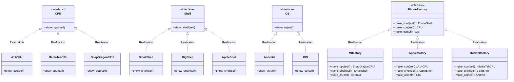

# 抽象工厂模式
## 定义
定义一个工厂类接口，让工厂子类来创建一系列相互依赖的对象
## 例子
* 生产一部手机，需要手机壳、CPU、操作系统这三类零件。不同品牌手机需要不同的手机壳、CPU以及操作系统。
* 与工厂模式不同，该为每个手机品牌创建工厂类来生产对应的零件并组装成为手机对象。

```mermaid
classDiagram
class CPU{
    <<interface>>
    +show_cpu(self)
}
class Shell{
    <<interface>>
    +show_shell(self)
}
class OS{
    <<interface>>
    +show_os(self)
}
class PhoneFactory{
    <<interface>>
    +make_shell(self)PhoneShell
    +make_cpu(self)CPU
    +make_os(self)OS
}

class SmallShell{
    +show_shell(self)
}
class BigShell{
    +show_shell(self)
}
class AppleShell{
    +show_shell(self)
}

class SnapDragonCPU{
    +show_cpu(self)
}
class A14CPU{
    +show_cpu(self)
}
class MediaTekCPU{
    +show_cpu(self)
}

class Android{
    +show_os(self)
}
class IOS{
    +show_os(self)
}

class MIfactory{
    +make_cpu(self)SnapDragonCPU
    +make_shell(self)SmallShell
    +make_os(self)Android
}
class Applefactory{
    +make_cpu(self)A14CPU
    +make_shell(self)AppleShell
    +make_os(self)IOS
}
class Huaweifactory{
    +make_cpu(self)MediaTekCPU
    +make_shell(self)BigShell
    +make_os(self)Android
}

Shell <|.. SmallShell : Realization
Shell <|.. BigShell : Realization
Shell <|.. AppleShell : Realization

CPU <|.. A14CPU : Realization
CPU <|.. MediaTekCPU : Realization
CPU <|.. SnapDragonCPU : Realization

OS <|.. Android : Realization
OS <|.. IOS : Realization

PhoneFactory <|.. MIfactory : Realization
PhoneFactory <|.. Applefactory : Realization
PhoneFactory <|.. Huaweifactory : Realization

```

